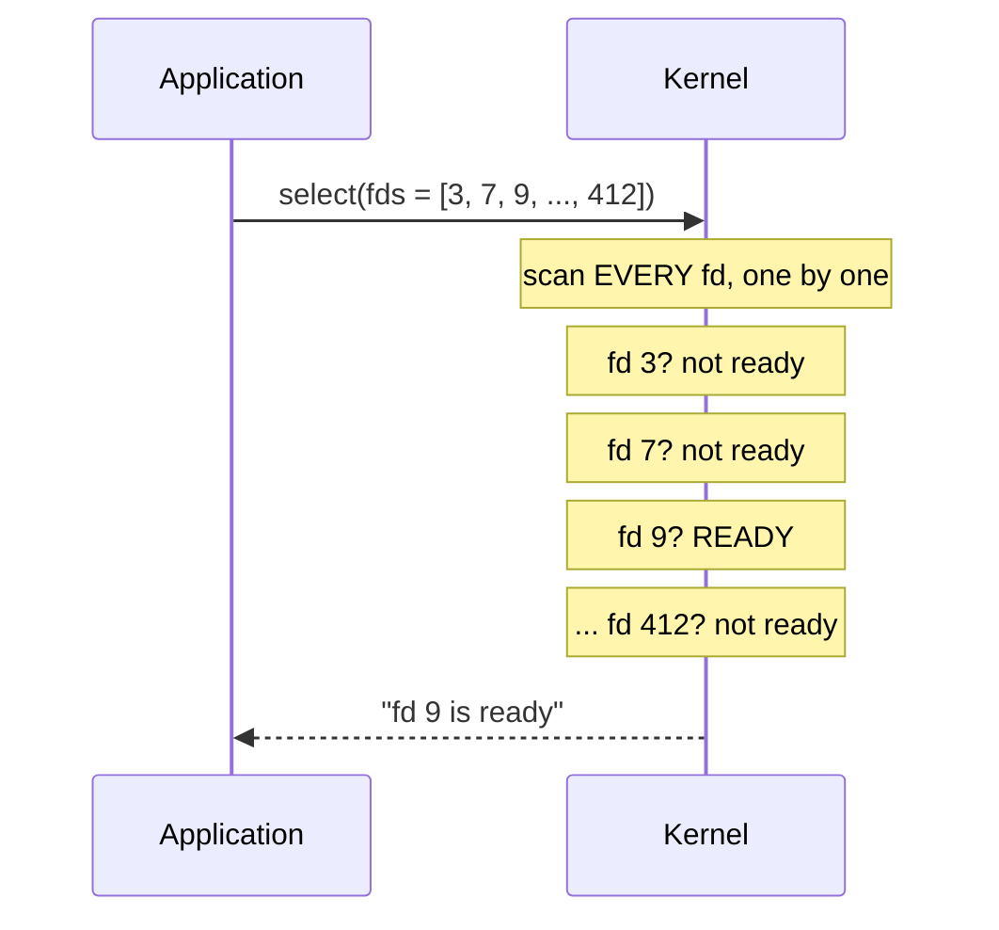
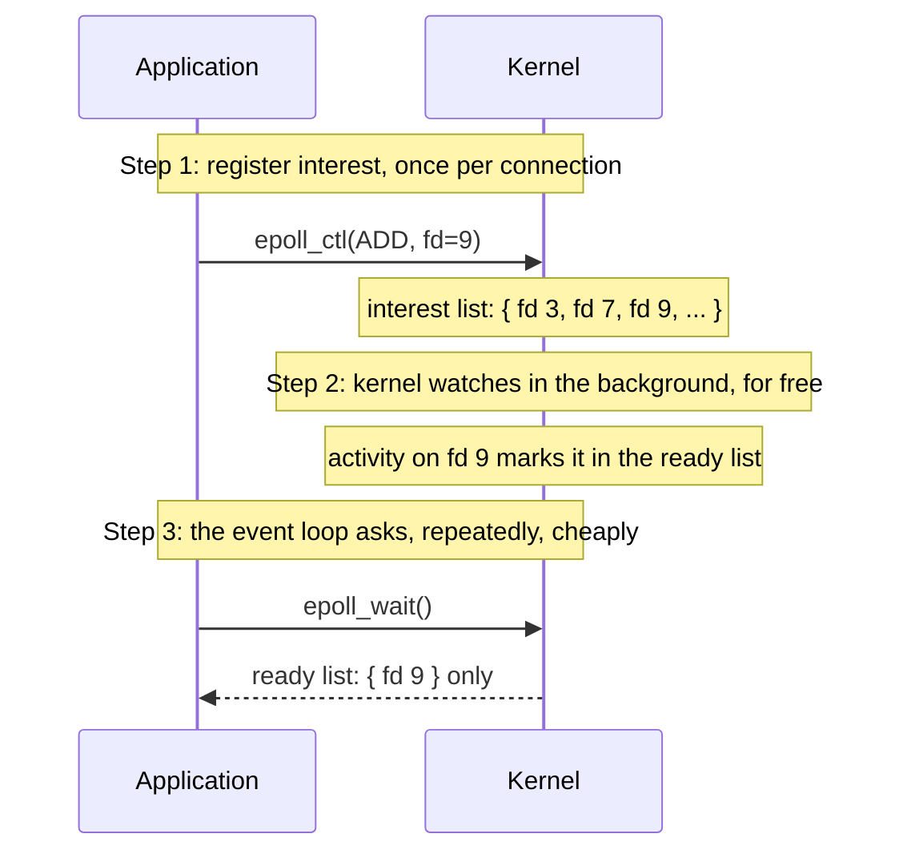
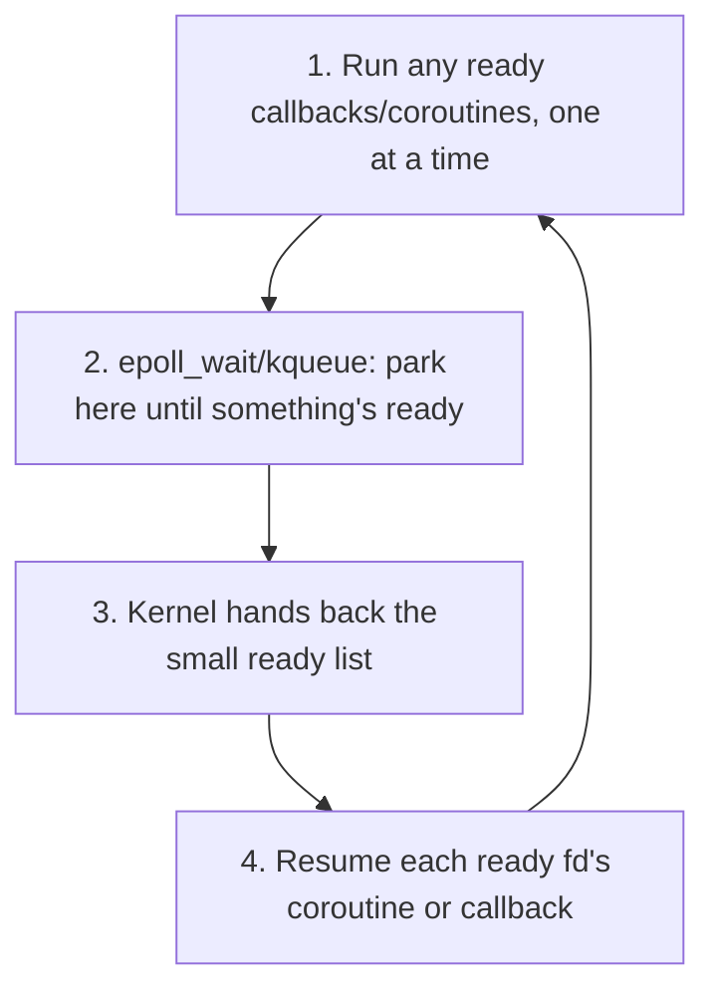

# Concurrency models: threads, processes, and event loops

The question this doc is actually answering: **if a server processes one
request at a time in a single thread, how can it possibly handle thousands
or millions of requests per second? Shouldn't that require lots of
threads?** The short answer is that "handling many requests" and "doing
many things in parallel" aren't the same claim, and the gap between them is
the entire reason event-loop-based servers exist. This doc works through
*why*, at the OS level, independent of any specific language. See
[docs/concepts/python-concurrency.md](python-concurrency.md), [docs/concepts/python-web-servers.md](python-web-servers.md), and
[docs/concepts/language-comparison.md](language-comparison.md) for how Python, the
web-framework layer, and other languages each build on top of what's here.

## Concurrency vs. parallelism, concretely

These two words get used interchangeably in casual conversation, but they
mean different things, and the difference is the crux of this whole topic.
FastAPI's own docs make the distinction with a fast-food analogy
([fastapi.tiangolo.com/async](https://fastapi.tiangolo.com/async/)):

- **Concurrency**: you order a burger, then go sit down and talk to your
  date while you wait for your number to be called. You're not doing two
  things *at the same instant*. You're doing one thing, then switching to
  another, then switching back, based on who's actually ready to make
  progress. Nobody stands idle staring at the counter.
- **Parallelism** is having two separate cashiers and two separate
  kitchens, with two orders being cooked at the exact same physical
  instant.

A single-threaded event loop gives you *concurrency*. Many requests appear
to make progress "at once" from the outside, without giving you
*parallelism*, because there's genuinely only one thread doing the work,
one instruction at a time. The trick that makes this non-contradictory is
that a huge fraction of what a typical web request does isn't computing
anything, it's **waiting**, whether that's for the client to finish
sending its request body, for a database query to come back, or for
another service's HTTP response. FastAPI's docs put it directly: "This is
the case for most of the web applications. Many, many users, but your
server is waiting 🕙 for their not-so-good connection to send their
requests" (same source as above). If most of a request's lifetime is
waiting, a single thread can service thousands of "waiting" requests by
simply not blocking on any one of them. It works on whichever one is
actually ready to move forward *right now*, and moves to the next the
instant it isn't.

## Three ways to handle "many requests at once," from the OS up

### 1. One OS process per connection

The oldest model (classic CGI scripts from the 1990s): the web server
forks a brand new operating-system process for every incoming request. Dead
simple, but a process is a genuinely heavyweight OS object. It gets its
own memory space, its own copy of everything, and creating one takes real
time and memory. This doesn't scale past a small number of simultaneous
connections and nobody builds servers this way anymore, but it's worth
knowing as the starting point everything else improved on.

### 2. One OS thread per connection

Threads are cheaper than processes, since they share memory with the
process that spawned them, so the natural next step was to keep one
process alive, and hand each new connection its own thread instead of its
own process. This is genuinely how most Java web servers worked for two
decades, and it does scale to real production traffic. But an OS thread is
still not free: Oracle's own Java docs describe it as coming with "a large
thread stack and other resources that are maintained by the operating
system," and states plainly that "the number of available platform
threads is limited to the number of OS threads," as documented at
[docs.oracle.com/en/java/javase/21/core/virtual-threads.html](https://docs.oracle.com/en/java/javase/21/core/virtual-threads.html).
Each thread reserves megabyte-scale stack memory whether it's busy or just
sitting there waiting on a database call, and the OS scheduler has to keep
switching the CPU's attention between however many threads exist. That's
real overhead that adds up. In practice, servers built this way run a **thread
pool** (a fixed number of reusable threads, commonly a few hundred to a few
thousand) instead of literally one thread per connection, precisely because
raw OS threads can't scale into the tens of thousands.

### 3. One thread, an event loop, and non-blocking I/O

The event-loop model keeps everything on a **single thread** and never lets
that thread sit idle waiting on I/O. Instead, when a task needs to wait
(for a network response, a disk read, whatever), it hands the *waiting*
part off to the operating system's kernel and immediately becomes available
to work on something else. When the kernel notices the thing being waited
for is ready, it notifies the event loop, which resumes exactly that piece
of work where it left off.

Node's own docs describe this precisely
([nodejs.org: Event Loop, Timers, and process.nextTick()](https://nodejs.org/en/learn/asynchronous-work/event-loop-timers-and-nexttick)):

> "The event loop is what allows Node.js to perform non-blocking I/O
> operations — despite the fact that a single JavaScript thread is used by
> default — by offloading operations to the system kernel whenever
> possible... Since most modern kernels are multi-threaded, they can handle
> multiple operations executing in the background. When one of these
> operations completes, the kernel tells Node.js so that the appropriate
> callback may be added to the poll queue to eventually be executed."

That last sentence is the important nuance for the natural follow-up
question, "isn't the kernel doing this with threads anyway?" Yes, in a
sense: the *operating system kernel itself* is multi-threaded and handles
the actual low-level I/O concurrently. What an event-loop runtime avoids is
creating an *application-level* OS thread per connection. There's one
thread running your code, and it only ever runs one callback/coroutine at a
time, but it's never stuck blocking on any single one, so it can
interleave work across thousands of in-flight requests using that one
thread's time efficiently.

This is a cooperative model, not a preemptive one: nothing forcibly
interrupts a running task the way an OS scheduler forcibly interrupts a
thread in model #2 above. A task only ever hands control back at an
explicit yield/await point. That distinction is the source of the main
trade-off below.

## The real trade-off: what event loops buy you, and what they cost

**What they buy you**: the ability to hold open a very large number of
mostly-idle, mostly-waiting connections cheaply, thousands to millions on
one machine, because each one costs a small amount of runtime-level
bookkeeping instead of a whole OS thread's memory and scheduling overhead.
This is specifically the "C10K and beyond" problem event loops were built
to solve.

**What it costs you**:

- **Cooperative scheduling means nothing is preemptive.** If any single
  piece of code running on the event loop does real work without ever
  yielding, whether that's a heavy CPU computation or a call that blocks
  the whole thread instead of handing control back, it freezes the *entire
  event loop* for every other in-flight request until it finishes. A
  traditional thread-per-request server doesn't have this failure mode:
  the OS scheduler forcibly preempts threads, so one slow thread can't
  starve the others. This is the sharpest practical downside of the
  event-loop model.
- **It doesn't help CPU-bound work at all.** Async only ever helps with
  *waiting*, never with *calculating*. Genuine parallel hardware (multiple
  processes, or multiple OS threads actually running simultaneously) is
  still required to speed up pure computation, regardless of which
  concurrency model a server uses.
- **It tends to be "viral" within a codebase.** Once part of a codebase is
  built around the event loop, calling into it from ordinary blocking-style
  code (and vice versa) usually needs an explicit adapter rather than
  mixing for free. See [docs/concepts/python-web-servers.md](python-web-servers.md) for a concrete real-world
  example of this in Django's async retrofit.

None of this makes the event-loop model strictly better or worse than
thread-per-request. They're solving the same underlying problem (serve
many concurrent, mostly-waiting clients without proportionally expensive
per-client overhead) with different mechanisms and different failure
modes. See [docs/concepts/language-comparison.md](language-comparison.md) for how Go and
Java's virtual threads represent a third answer to this same problem.

## Tying it back to the original question

To directly answer "shouldn't a server be async by default to handle
thousands/millions of requests," a thread-per-request server genuinely can
handle thousands of requests per second; that's exactly how Java ran
production web traffic for two decades, and how many traditional
synchronous deployments still run today. The place a plain
thread-per-request design actually starts to struggle is much higher up,
at tens of thousands of *simultaneous, mostly-idle* connections on one
machine, because of the per-thread memory and OS-scheduling cost described
above (the "C10K" territory). Event loops and lightweight
runtime-managed threads (covered in the other docs linked above) are two
different, independently-arrived-at answers to that specific, narrower
scaling wall, not a general "sync is bad, async is good" story.

---

## Appendix: how model #3 actually works under the hood

Everything above is enough to answer the doc's opening question. This
appendix goes one level deeper into model #3 specifically, covering the
historical problem that motivated it, the actual kernel mechanism behind
it, and (for readers coming from JavaScript) how Python's coroutines
specifically differ from a Promise. It's for when you want the mechanism
behind "the kernel notifies the event loop," not just the fact of it.

### Python coroutines vs. JavaScript Promises

Quick version, since it comes up naturally once you start comparing
Python's event loop to Node's: a Python coroutine is **not** the same
thing as a JS Promise, and the difference is a common source of bugs for
anyone porting JS intuition over. A JS Promise is *eager*: calling an
async function starts the work immediately, and the Promise is just a
handle to check on it later. A Python coroutine is *lazy*, per its own
docs ([docs.python.org/3/library/asyncio-task.html](https://docs.python.org/3/library/asyncio-task.html)):
"a coroutine object is created but not awaited, so it won't run at all."
Calling a coroutine function does nothing until something actually drives
it, whether that's `await`, or wrapping it in a `Task`. The object that
*does* map onto a Promise is `asyncio.Future` ("represents an eventual
result of an asynchronous operation," as documented at
[docs.python.org/3/library/asyncio-future.html](https://docs.python.org/3/library/asyncio-future.html)),
not the bare coroutine.

Full writeup, with the concrete sequential-vs-concurrent timing example
from Python's own docs and a JS↔Python terminology table, in
[docs/concepts/python-concurrency.md](python-concurrency.md).

### The C10K problem

The scaling wall that models #1 and #2 hit is famous enough to have a
name, the **C10K problem**: handling **10,000 concurrent connections on a
single server**. The name and the original write-up come from a page by
Dan Kegel, [kegel.com/c10k.html](http://www.kegel.com/c10k.html); flagging
this one as a historical/community reference rather than an official spec,
since no single vendor "owns" the term, but it's the standard, widely-cited
source for it. The page itself has been continuously updated since the
late 1990s and is the origin of the phrase.

The framing is worth reading in Kegel's own words, because it pins down
exactly what kind of problem this is: not a hardware problem, but a
*software architecture* problem: "It's time for web servers to handle ten
thousand clients simultaneously, don't you think?" His point was that by
the time he wrote it, ordinary hardware (he cites a $1200 machine with 1GB
of RAM and gigabit networking) was already fast enough to shuttle that
much traffic. The thing actually standing in the way was how servers were
built in software, specifically the process-per-connection and
thread-per-connection designs above (models #1 and #2). He states the
concrete ceiling directly: "one process for each client (classic Unix
approach, used since 1980 or so)" or one thread per client runs out of
room fast. On a 32-bit Linux system with the default 2MB stack per thread,
"you'd max out around 512 threads before exhausting virtual address
space," nowhere near 10,000, and he notes "many OS's also have trouble
handling more than a few hundred threads" even before hitting a hard
memory wall. The OS scheduler and its bookkeeping per thread start costing
real overhead well before any theoretical limit is reached.

His prescribed fix is exactly model #3 above: instead of one thread
reserving memory and scheduler attention per connection, use what he calls
"nonblocking I/O and readiness notification," meaning mechanisms such as
`select()`, `poll()`, `/dev/poll`, `kqueue()`, or (the one that won out on
Linux, and the one `asyncio` and Node both actually use today, per the
earlier discussion of epoll) `epoll()`, so a single thread can ask the
kernel "which of my thousands of connections are ready?" instead of
needing a thread standing by for each one. This is the direct link between
the C10K problem and the event-loop architecture: the event loop *is* the
software-architecture fix Kegel's page was arguing for, and epoll/kqueue
are the specific kernel mechanisms that make it possible.

### How readiness notification actually works: select/poll vs. epoll/kqueue

"fds" below is short for **file descriptors**, the small integer handles
the OS hands a process for each open socket, file, or pipe, used to refer
to it in later syscalls.

The diagrams below illustrate the mechanics documented in the Linux man
pages for these exact system calls. Every term in quotes is the man
page's own wording, not a paraphrase:

- **[`epoll(7)`](https://man7.org/linux/man-pages/man7/epoll.7.html)**
  defines the two data structures by name: "The *interest* list (sometimes
  also called the epoll set): the set of file descriptors that the process
  has registered an interest in monitoring," and "The *ready* list: the
  set of file descriptors that are 'ready' for I/O. The ready list is a
  subset of (or, more precisely, a set of references to) the file
  descriptors in the interest list."
- **[`epoll_ctl(2)`](https://man7.org/linux/man-pages/man2/epoll_ctl.2.html)**
  is the registration call. Its `EPOLL_CTL_ADD` operation is described as
  used to "add an entry to the interest list of the epoll file
  descriptor."
- **[`epoll_wait(2)`](https://man7.org/linux/man-pages/man2/epoll_wait.2.html)**
  is the retrieval call. It "waits for events on the epoll instance,"
  returning "information from the ready list about file descriptors in
  the interest list that have some events available."
- **[FreeBSD's `kqueue(2)`](https://man.freebsd.org/cgi/man.cgi?kqueue)**
  documents the same two-step split for its own mechanism: `kevent()` "is
  used to register events with the queue" (via the `EV_ADD` flag on a
  changelist) and, in the same call, to "return any pending events to the
  user," stating explicitly that "all changes contained in the changelist
  are applied before any pending events are read from the queue." That's
  the same register-then-retrieve pattern as `epoll_ctl`/`epoll_wait`, just
  one syscall instead of two.

The diagrams themselves, meaning the boxes, arrows, and step numbering,
are my own illustration built on top of those definitions, not a
reproduction of anything in the man pages. They're useful for turning
"epoll" and "kqueue" from keywords into an actual mental picture of what
happens on each call.

**The old way, `select()`/`poll()`: re-describe your whole watch list, every single call.**

Cost per call: proportional to the TOTAL number of watched fds, not the
number that are actually ready. Watching 10,000 connections means 10,000
checks on every single call, even if only one of them has data. This
linear rescan is exactly the bottleneck Kegel's page points at.

**The fix, `epoll` (Linux) / `kqueue` (BSD, macOS): register once, then only ask "what's ready."**

Cost per call: proportional to how many fds actually became ready, not
how many you're watching. 10,000 watched connections, 1 ready = 1 unit of
work, every time. This is what the epoll man page means by "scales well
to large numbers of watched file descriptors."

**One full event-loop tick, tying it together.** This is what Node's
libuv and Python's `asyncio` are both doing under the hood, every
iteration:

Steps 2 and 3 are exactly what Node's own docs (quoted above) mean by "the
kernel tells Node.js so that the appropriate callback may be added to the
poll queue." `epoll_wait`/`kqueue` is the actual system call underneath
that sentence.
