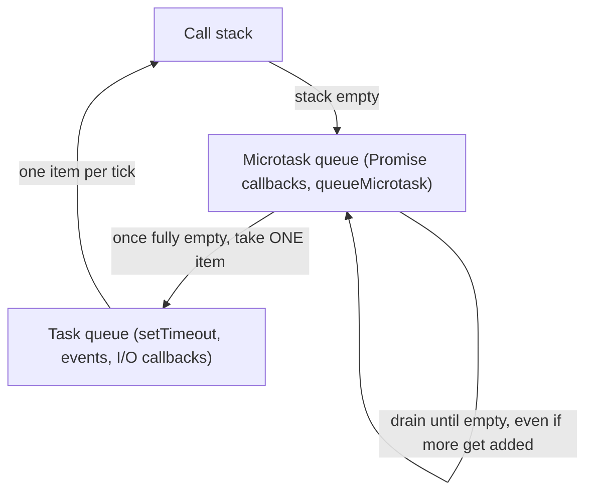
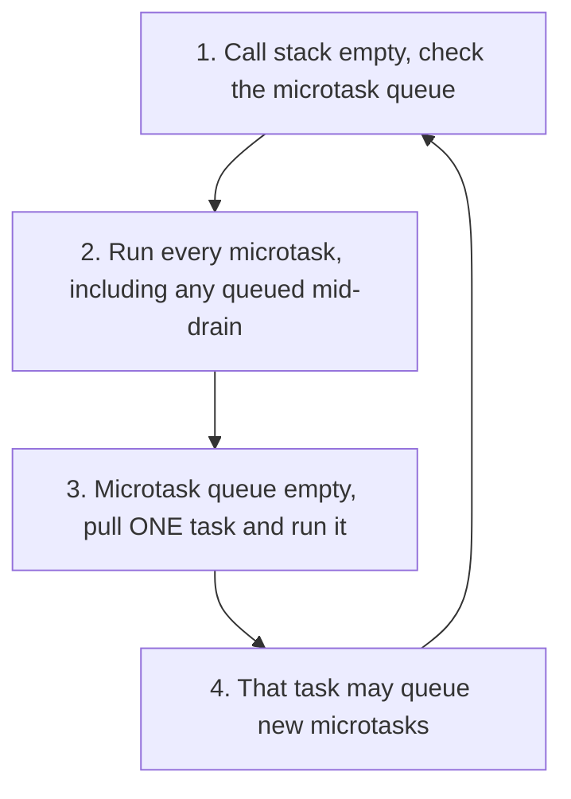

# JavaScript's event loop: a refresher

This doc assumes you already know roughly how JavaScript's async model
feels to use, meaning `async`/`await`, `Promise`, `setTimeout`. What it
walks through carefully is the actual *mechanics* underneath: the call
stack, the two separate queues that feed it, and the one ordering rule
that's most often misremembered. It stands on its own, but it exists
specifically to set up a fair comparison with Python's event loop in
[docs/concepts/python-concurrency.md](python-concurrency.md) and [docs/concepts/concurrency-models.md](concurrency-models.md).
Read those for the Python side and the OS-level mechanics both languages
build on.

## The call stack and the two queues that feed it

**The call stack** is the same call stack every language has: it's what's
currently running, one frame per function call, last-in-first-out. When the
stack is empty, the JS engine isn't executing anything, and it's free to
pull new work.

**The task queue** (also called the **macrotask queue**; "macrotask" isn't
official spec terminology, it's just the common name people use to
distinguish these from microtasks) holds callbacks waiting to run once the
stack is empty: a `setTimeout` callback whose timer fired, a click handler
waiting for a user event, an `setInterval` tick. MDN's own event loop page
describes the underlying model in these terms: a callback "defines a
**job**, which gets placed into a **job queue**—or, in HTML terminology, an
event loop—once the action is completed. Every time, the agent pulls a job
from the queue and executes it," as documented at
[developer.mozilla.org/en-US/docs/Web/JavaScript/Event_loop](https://developer.mozilla.org/en-US/docs/Web/JavaScript/Event_loop).

**The microtask queue** is a second, separate queue, and it's the one most
people misremember the behavior of. A microtask is mainly what a resolved
or rejected `Promise`'s `.then()`/`.catch()`/`.finally()` callback gets
turned into, plus anything explicitly scheduled with `queueMicrotask()`.
MDN's dedicated microtask guide defines it precisely: a microtask is "a
short function which is executed after the function or program which
created it exits _and_ only if the JavaScript execution stack is empty, but
before returning control to the event loop being used by the user agent to
drive the script's execution environment," as documented in
[developer.mozilla.org: Microtask guide](https://developer.mozilla.org/en-US/docs/Web/API/HTML_DOM_API/Microtask_guide).

## The one rule that matters most: microtasks drain completely before the next task

This is the fact that gets misremembered the most, so it's worth stating
precisely, in the spec's own words rather than a paraphrase. MDN's event
loop page states the priority directly: "HTML event loops split jobs into
two categories: _tasks_ and _microtasks_. Microtasks have higher priority
and the microtask queue is drained first before the task queue is pulled"
([same MDN page as above](https://developer.mozilla.org/en-US/docs/Web/JavaScript/Event_loop)).
The microtask guide spells out the actual mechanism behind that priority:
"Each time a task exits, the event loop checks to see if the task is
returning control to other JavaScript code. If not, it runs all of the
microtasks in the microtask queue," as documented in the
[MDN Microtask guide](https://developer.mozilla.org/en-US/docs/Web/API/HTML_DOM_API/Microtask_guide).

The part that actually trips people up is what happens when a microtask
schedules *another* microtask while it's running. It doesn't get deferred
to the next task. It still runs before the next task, because the drain
loop keeps going until the queue is empty, not just once through the queue
as it stood at the start. MDN states this exactly: "If a microtask adds
more microtasks to the queue by calling `queueMicrotask()`, those
newly-added microtasks _execute before the next task is run_. That's
because the event loop will keep calling microtasks until there are none
left in the queue, even if more keep getting added," per the same
[MDN Microtask
guide](https://developer.mozilla.org/en-US/docs/Web/API/HTML_DOM_API/Microtask_guide).
That page also flags the obvious risk: "there's a real risk of getting the
event loop endlessly processing microtasks" if microtasks keep scheduling
more of themselves forever, since the macrotask queue (timers, I/O,
rendering) never gets a turn until the microtask queue is actually, fully
empty.

One more precise detail worth stating exactly, since it explains why a
single top-level statement can already look "asynchronous" without any
`setTimeout` involved: calling an `async` function runs its body
**synchronously** up to the first `await`. MDN's own words: "Top-level
code, up to and including the first `await` expression (if there is one),
is run synchronously. In this way, an async function without an await
expression will run synchronously," per [MDN's `async function`
page](https://developer.mozilla.org/en-US/docs/Web/JavaScript/Reference/Statements/async_function).
So `await` isn't what makes an async function's body run later. It's what
makes the function *pause and hand control back*, with everything after
that `await` resuming as a microtask once the awaited value settles.

## Diagram: the three pieces and where work goes



The key visual difference from the task queue: the microtask queue gets
**fully drained** every time it's checked, including anything added during
that drain. The task queue only ever gives up **one** item per pass before
the engine goes back and checks the microtask queue again.

## One full tick, traced through



## Making it concrete: a code example and its actual output

```javascript
console.log("1: sync");

setTimeout(() => {
  console.log("2: macrotask (setTimeout)");
}, 0);

Promise.resolve().then(() => {
  console.log("3: microtask (first .then)");
  Promise.resolve().then(() => {
    console.log("4: microtask queued DURING a microtask");
  });
});

console.log("5: sync");
```

Actual output order:

```
1: sync
5: sync
3: microtask (first .then)
4: microtask queued DURING a microtask
2: macrotask (setTimeout)
```

Walking through why: `console.log("1")` and `console.log("5")` run
immediately as part of the initial synchronous script. Nothing pauses
between them, so they both beat every queued callback. `setTimeout(...,
0)` doesn't run at 0ms in any real sense; it schedules a **macrotask**,
so it has to wait for the entire current script to finish *and* for the
microtask queue to fully drain. `Promise.resolve().then(...)` schedules a
**microtask**, so it runs before that macrotask, but not before the rest
of the synchronous script, since the stack has to be empty first. And
line 4, a microtask scheduled from inside another microtask, still runs
*before* the `setTimeout` callback, exactly per the "keep draining even if
more get added" rule above; it does not get pushed behind the pending
timer.

## Where Node.js's event loop adds more phases, and diverges

Everything above is the **browser-spec model** (defined by WHATWG's HTML
Standard, [html.spec.whatwg.org/multipage/webappapis.html](https://html.spec.whatwg.org/multipage/webappapis.html),
specifically its "Event loops" section). Node.js runs JavaScript outside a
browser, so it needs its own answer for I/O, timers, and process-level
concerns the browser spec doesn't cover, such as file reads, TCP sockets,
and deciding when the process is allowed to exit. Node's own docs describe
the result as a series of **phases**, each with its own queue of
callbacks, that the loop cycles through in order, per
[nodejs.org: Event Loop, Timers, and process.nextTick()](https://nodejs.org/en/learn/asynchronous-work/event-loop-timers-and-nexttick):

- **timers**: "this phase executes callbacks scheduled by `setTimeout()`
  and `setInterval()`."
- **pending callbacks**: "executes callbacks for some system operations
  such as types of TCP errors."
- **idle, prepare**: internal-only, not relevant to application code.
- **poll**: "retrieve new I/O events; execute I/O related callbacks
  (almost all with the exception of close callbacks, the ones scheduled by
  timers, and `setImmediate()`); node will block here when appropriate."
  This is the phase that does the actual epoll/kqueue-style waiting
  described in [docs/concepts/concurrency-models.md](concurrency-models.md)'s appendix.
- **check**: where `setImmediate()` callbacks run; Node's docs describe
  `setImmediate()` as "actually a special timer that runs in a separate
  phase of the event loop," distinct from the timers phase.
- **close callbacks**: e.g. a `socket.destroy()` firing a `'close'`
  event.

That's already more structure than the browser spec has. The browser
model above is really just "microtasks, then one task" repeated; it
doesn't have named phases like poll or check. On top of that, Node adds a
mechanism with **no browser-spec equivalent at all**: `process.nextTick()`.
Node's docs are explicit that it sits outside the phase list entirely: "`process.nextTick()`
was not displayed in the diagram, even though it's a part of the
asynchronous API. This is because `process.nextTick()` is not technically
part of the event loop. Instead, the `nextTickQueue` will be processed
after the current operation is completed, regardless of the current phase
of the event loop." It also drains **before** promise microtasks and
before the loop moves to its next phase: "any time you call
`process.nextTick()` in a given phase, all callbacks passed to
`process.nextTick()` will be resolved before the event loop continues"
(same source). So the real Node ordering, from highest to lowest priority
after any synchronous code finishes, goes like this: the
`process.nextTick()` queue fully drains first, then the promise microtask
queue fully drains, then one callback runs from whichever phase the loop
is currently in. Don't treat "Node's event loop" and "the browser's event
loop" as the same thing with a different name. They share the
microtask-draining idea, but Node's phase structure and its `nextTick`
queue are genuine, documented differences on top of it, not just an
implementation detail.

## The event loop isn't part of the JavaScript *language*

This is easy to miss because it's invisible in day-to-day code, but it's
worth being precise about: the event loop is not something ECMA-262 (the
actual ECMAScript/JavaScript language specification, at
[tc39.es/ecma262](https://tc39.es/ecma262/)) defines. ECMA-262 defines the
*language*, meaning syntax, `Promise` and `async`/`await` semantics, and
an abstract "Job" concept used to describe ordering guarantees around
Promises, but it does not define timers, I/O, or an actual scheduling
loop that keeps a program alive and pulls work off queues. That's left
entirely to whatever **host environment** is running the code: the WHATWG
HTML spec for browsers, or Node.js's/Deno's/Bun's own runtime code for
those. MDN's event loop page gestures at exactly this split when it notes
that, beyond the language spec's own execution model, "we need additional
environment-specific mechanisms provided by the **host environment**," and
that it will "occasionally talk about mechanisms defined in the HTML spec,
which is often mimicked by other host environments like Node.js or Deno,"
as documented at
[developer.mozilla.org/en-US/docs/Web/JavaScript/Event_loop](https://developer.mozilla.org/en-US/docs/Web/JavaScript/Event_loop).
Node's own "About Node.js" page is a clean illustration from the runtime
side: it describes Node as presenting "an event loop as a runtime
construct instead of as a library," per
[nodejs.org/en/about](https://nodejs.org/en/about). That's language that
only makes sense if the event loop is something the *runtime* provides,
not something baked into the JS language itself.

Neither ECMA-262 nor MDN states outright, in those exact words, "the event
loop is not part of the JavaScript language." The two quotes above are
the closest direct citations (MDN describing host-environment mechanisms
as something *additional* to the language spec's own execution model;
Node's own docs describing the event loop as a thing the runtime
supplies). The conclusion itself is reasoned from each spec's stated
scope: ECMA-262 has a "Jobs and Host Operations to Enqueue Jobs" section
that explicitly hands scheduling off to the host, rather than an "event
loop" section of its own. The language spec stops at the language and
the Jobs abstraction, and the actual event loop is host-defined.

## See also

- [docs/concepts/javascript-runtimes.md](javascript-runtimes.md) covers how V8, Node, Deno, Bun,
  and WebKit/JavaScriptCore each fit into the engine/host split described
  above, and what each one's event loop is actually implemented on top of.
- [docs/concepts/python-concurrency.md](python-concurrency.md) covers how Python's coroutines and
  `asyncio.Future` map onto (and diverge from) the Promise-based model
  described here.
- [docs/concepts/python-event-loop.md](python-event-loop.md) covers Python's event loop
  internals directly against this doc's call stack/microtask/macrotask
  model, including the biggest structural difference: Python has one FIFO
  ready queue, not two prioritized queues.
- [docs/concepts/concurrency-models.md](concurrency-models.md) covers the OS-level mechanism
  (epoll, kqueue) that both Node's poll phase and Python's `asyncio` event
  loop actually use to know when I/O is ready, independent of language.
