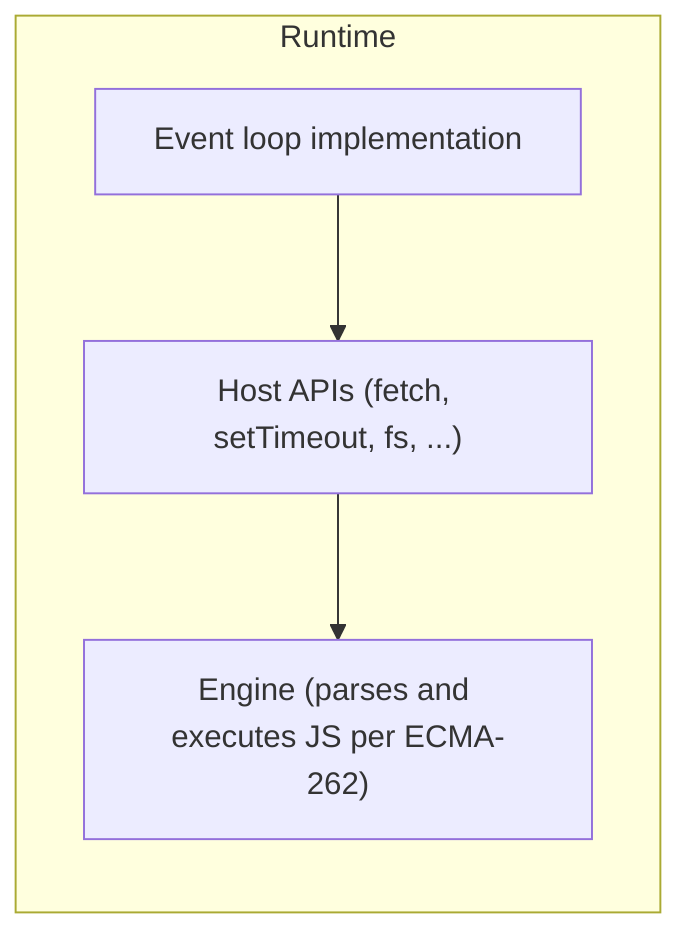
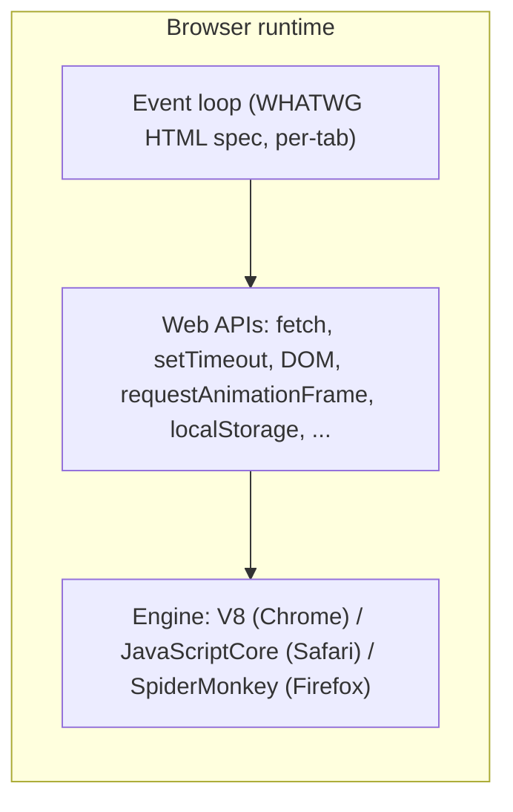
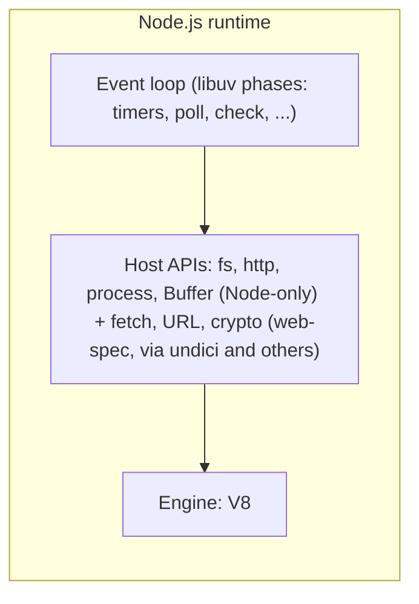
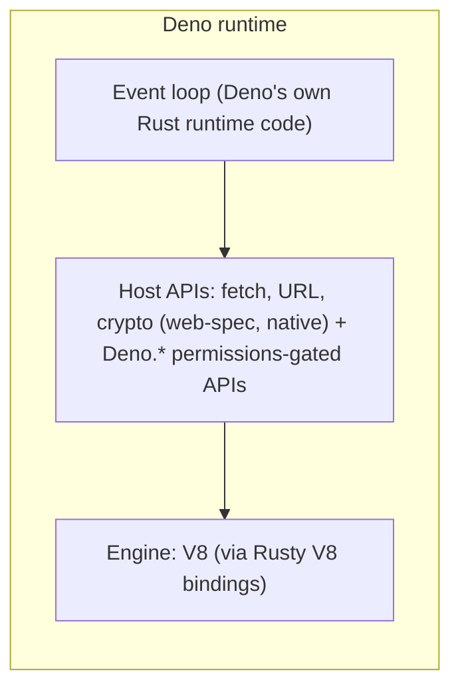
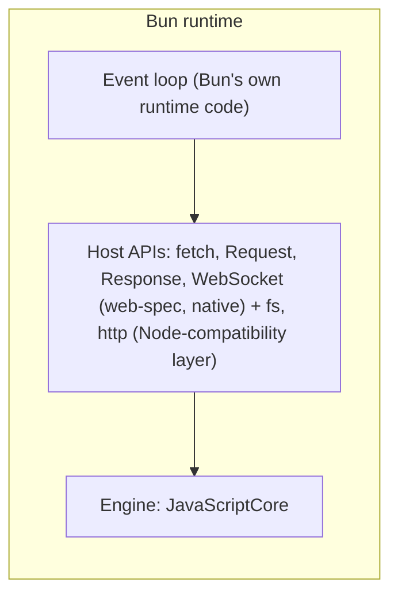
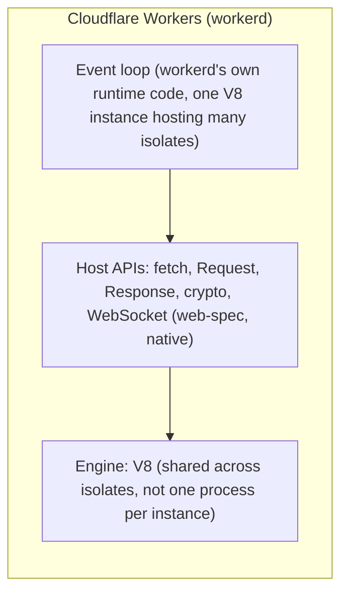

# JavaScript engines, host APIs, and runtimes

[docs/concepts/javascript-event-loop.md](javascript-event-loop.md) covers the event loop's mechanics
and makes one point in passing that this doc exists to follow all the way
through: the event loop isn't part of the JavaScript language itself.
Neither is `fetch`. Neither is `setTimeout`. None of the things that make
JavaScript actually useful, talking to a network, waiting on a timer,
reading a file, drawing a frame, come from the JavaScript language spec.
They come from whatever environment is running the code, and different
environments provide different sets of them.

That's the whole subject of this doc: the three separate pieces of
software involved every time JavaScript runs anywhere (an **engine**, a
set of **host APIs**, and the **runtime** that glues them into something
you can actually build on), what each piece is and isn't responsible for,
and how those pieces look different once you line up a browser tab next
to Node, Deno, Bun, and Cloudflare Workers. It closes with a short,
sourced look at where each of these actually gets used in production.
For the low-level HTTP server primitives each runtime exposes, and how
frameworks build on top of them, see
[docs/concepts/javascript-web-servers.md](javascript-web-servers.md), which this doc doesn't repeat.

## Table of contents

- [Why JavaScript needs three separate pieces](#why-javascript-needs-three-separate-pieces)
  - [Where the language spec stops](#where-the-language-spec-stops)
  - [The three layers at a glance](#the-three-layers-at-a-glance)
- [Engines](#engines)
  - [V8](#v8)
  - [JavaScriptCore](#javascriptcore)
  - [SpiderMonkey](#spidermonkey)
  - [Other engines worth knowing](#other-engines-worth-knowing)
- [Host APIs](#host-apis)
  - [Web-standard APIs](#web-standard-apis)
  - [Runtime-native APIs](#runtime-native-apis)
  - [Presentation APIs](#presentation-apis)
  - [Permission-gated APIs](#permission-gated-apis)
  - [Other host APIs worth knowing](#other-host-apis-worth-knowing)
  - [Case study: requestAnimationFrame draws the clearest boundary](#case-study-requestanimationframe-draws-the-clearest-boundary)
  - [Case study: fetch converging across every environment](#case-study-fetch-converging-across-every-environment)
- [Runtimes](#runtimes)
  - [The browser](#the-browser)
  - [Node.js](#nodejs)
  - [Deno](#deno)
  - [Bun](#bun)
  - [Cloudflare Workers and workerd](#cloudflare-workers-and-workerd)
  - [Other runtimes worth knowing](#other-runtimes-worth-knowing)
- [Putting the layers together](#putting-the-layers-together)
  - [Ownership by layer](#ownership-by-layer)
  - [Named examples by layer](#named-examples-by-layer)
  - [Full comparison table](#full-comparison-table)
- [Where each of these actually gets used](#where-each-of-these-actually-gets-used)
- [See also](#see-also)

## Why JavaScript needs three separate pieces

### Where the language spec stops

ECMA-262, the actual ECMAScript spec published by Ecma International at
[tc39.es/ecma262](https://tc39.es/ecma262/), defines syntax and
`Promise`/`async`/`await` *semantics*, plus an abstract "Job" concept used
to describe ordering guarantees around Promises. It does not define
timers, network access, file access, or an actual scheduling loop that
keeps a program alive and pulls work off queues. [docs/concepts/javascript-event-loop.md](javascript-event-loop.md)'s
closing section covers this in more depth, including the exact spec
language ECMA-262 uses to hand scheduling off to "Host Operations" rather
than defining a loop of its own. This doc picks up right where that one
leaves off: if the language spec stops at the language, something else
has to define everything above it, and that something is a different
piece of software for every environment JavaScript runs in.

### The three layers at a glance

A JavaScript **engine**, such as V8, JavaScriptCore, or SpiderMonkey,
parses JavaScript source and executes it according to the ECMAScript
language spec. That's genuinely all an engine does on its own: it has no
concept of an event loop, no `setTimeout`, no `fetch`, no way to read a
file or draw a pixel. Those aren't language features.

**Host APIs** are everything an engine can't do on its own: talking to
the network, reading a file, starting a timer, listening for a click,
drawing a frame. "Host" here means whatever software is hosting the
engine, a browser, Node, Deno, Bun, or `workerd`, and each host ships its
own set of these APIs, under its own name, sometimes overlapping with
another host's set almost entirely and sometimes not at all.

A **runtime** is the whole package: it embeds an engine, provides a set
of host APIs on top of it, and supplies the actual event loop
implementation that drives everything, deciding what runs next when the
call stack is empty. A browser is a runtime. Node.js is a runtime. Deno,
Bun, and `workerd` are runtimes. The same engine can sit inside more than
one runtime (V8 sits inside Chrome, Node, and `workerd`), and the host
APIs and event loop behavior each of those runtimes provides can differ
in real, documented ways even when the underlying engine is identical.

The rest of this doc walks through each layer in turn, engines first,
then host APIs, then runtimes, since a runtime is just an engine plus a
set of host APIs plus an event loop, and it's easier to see what each
runtime actually adds once the first two layers are already familiar on
their own.

## Engines

### V8

V8 is Google's engine. Its own docs describe it plainly: "V8 is Google's
open source high-performance JavaScript and WebAssembly engine, written
in C++. It is used in Chrome and in Node.js, among others," per
[v8.dev/docs](https://v8.dev/docs). That "among others" is doing real
work: V8 by itself doesn't decide what runs it. It's just the thing that
parses and executes JS/WASM per spec, with no event loop, no I/O, and no
timers of its own. Whatever *embeds* V8 (Chrome, Node, Deno, `workerd`,
covered in the [Runtimes](#runtimes) section below) is the piece that
supplies those.

### JavaScriptCore

JavaScriptCore, often abbreviated JSC, is WebKit's engine, the one behind
Safari. Its own docs describe it directly: "JavaScriptCore is the
built-in JavaScript engine for WebKit, which implements ECMAScript as in
ECMA-262 specification," per
[docs.webkit.org: JavaScriptCore](https://docs.webkit.org/Deep%20Dive/JSC/JavaScriptCore.html).
JSC isn't limited to Safari, either: it's also the engine Bun chose to
build on, covered in the [Bun](#bun) section below, which is the detail
that most often surprises people expecting every non-browser runtime to
be V8-based.

### SpiderMonkey

SpiderMonkey is Mozilla's engine, the one behind Firefox, described on
its own documentation site simply as the "SpiderMonkey JavaScript/
WebAssembly Engine," per
[spidermonkey.dev/docs](https://spidermonkey.dev/docs/). Chrome (V8),
Safari (JavaScriptCore), and Firefox (SpiderMonkey) running on
completely different engines, written by different teams, with different
internal architectures, and yet producing identical `setTimeout` and
microtask-draining behavior, is the single cleanest illustration of the
whole engine/host-API split in this entire doc; the [browser](#the-browser)
section below covers exactly why that's true.

### Other engines worth knowing

The three above cover the overwhelming majority of JavaScript execution
in practice, but they're not the only engines that exist.

#### Chakra

Chakra (and its open source core, ChakraCore) was Microsoft's own engine,
used in the pre-Chromium Microsoft Edge and Internet Explorer, until
Microsoft switched Edge to the Chromium project and V8 with Edge 79 in
January 2020. ChakraCore has continued on in other, non-browser projects
since, per the maintainers' own discussion at
[github.com/microsoft/ChakraCore#5865](https://github.com/microsoft/ChakraCore/issues/5865).

#### Hermes

Hermes is Meta's engine, purpose-built rather than general-purpose: its
own repository describes it as "a JavaScript engine optimized for fast
start-up of React Native apps," per
[github.com/facebook/hermes](https://github.com/facebook/hermes). It's
the default engine React Native ships with today, trading some
general-purpose performance for a much smaller, faster-starting footprint
suited to mobile app launches.

#### QuickJS

QuickJS, written by Fabrice Bellard and Charlie Gordon, is at the
opposite end of the size spectrum on purpose: "a small and embeddable
Javascript engine," implemented in "just a few C files, no external
dependency," per [bellard.org/quickjs](https://bellard.org/quickjs/). It
shows up inside other tools covered later in this doc's [Other runtimes
worth knowing](#other-runtimes-worth-knowing) section rather than as a
consumer-facing product on its own.

#### GraalJS

GraalJS takes yet another approach, running on the JVM instead of as
native code: its own repository describes it as "a high-performance,
ECMAScript compliant, and embeddable JavaScript runtime for Java," per
[github.com/oracle/graaljs](https://github.com/oracle/graaljs), aimed at
Java applications that need to embed JavaScript rather than at running JS
as a primary language on its own.

## Host APIs

"Host API" is the general term this doc uses for the concept MDN calls
the **host environment**'s own contribution, noting that JavaScript's
execution model needs "additional environment-specific mechanisms
provided by the host environment," mechanisms that are "often mimicked
by other host environments like Node.js or Deno," per
[developer.mozilla.org/en-US/docs/Web/JavaScript/Event_loop](https://developer.mozilla.org/en-US/docs/Web/JavaScript/Event_loop).
"Web API" is just what that same concept is called specifically when the
host is a browser, per MDN's own Web API reference, "the APIs and
interfaces (object types) that you may be able to use while developing
your Web app or site," per
[developer.mozilla.org/en-US/docs/Web/API](https://developer.mozilla.org/en-US/docs/Web/API).
With the terminology out of the way, what's actually more useful is
seeing that "host API" isn't one uniform bucket. In practice, every
runtime's host API surface is made of a few genuinely different kinds of
things, and knowing which kind a given API belongs to predicts a lot
about how portable it is.

### Web-standard APIs

Defined by a spec body outside any single runtime (WHATWG for
`fetch`/`URL`/streams, the W3C for `crypto`, and so on), and implemented
independently by multiple hosts. `fetch`, `URL`, and
`crypto.randomUUID()` are the clearest examples: a browser, Node, Deno,
Bun, and `workerd` each ship their own implementation of the same spec,
so code written against them tends to travel across runtimes with little
or no change. This is the category the
[fetch case study](#case-study-fetch-converging-across-every-environment)
below covers in depth, including why it wasn't always this way.

### Runtime-native APIs

Invented by one specific runtime, documented only in that runtime's own
reference, and not backed by any outside spec. Node's `fs`, `http`, and
`process` are runtime-native; so is `Deno.*` (documented at
[docs.deno.com/api](https://docs.deno.com/api/deno/)), and so is
`Bun.*`. These don't travel across runtimes at all unless another
runtime deliberately builds a compatibility shim for them, the way Bun
built one for Node's `fs`/`http` (covered in
[docs/concepts/javascript-web-servers.md](javascript-web-servers.md)).

### Presentation APIs

Exist only because a host has an actual page or display to manage, not
because of any language-level need. The DOM, `requestAnimationFrame`, and
`localStorage` are all in this category, all browser-only, and all
absent from every server-side runtime in this doc for the structural
reason the [requestAnimationFrame case study](#case-study-requestanimationframe-draws-the-clearest-boundary)
below covers: there's no display to synchronize with or page to persist
data for on a server.

### Permission-gated APIs

A layer some runtimes add on top of their own otherwise-ordinary host
APIs, restricting access unless the code (or the person running it)
explicitly grants it. Deno's own docs describe this directly: "a program
run with Deno has no access to sensitive APIs, such as file system
access, network connectivity, or environment access... You must
explicitly grant access to these resources with command line flags or
with a runtime permission prompt," per
[docs.deno.com/runtime/fundamentals/security](https://docs.deno.com/runtime/fundamentals/security/).
The underlying API (`Deno.readFile`, say) is still just a runtime-native
host API by the definition above; the permission system is a second,
independent host API wrapped around it, deciding whether a given call is
even allowed to run.

### Other host APIs worth knowing

The four categories above cover the host APIs the rest of this doc deals
with directly, but two other patterns are worth knowing exist, because
they show the same underlying idea, "the engine can't do this on its
own, so something else provides it," stretched to less obvious cases.

#### WASI

WASI (the WebAssembly System Interface) is effectively a host-API
equivalent for WebAssembly modules in general, not JavaScript
specifically: it's "a group of standards-track API specifications for
software compiled to the W3C WebAssembly (Wasm) standard," designed so
that "software written in different languages" can run "without costly
and clunky interface systems like HTTP-based microservices," per
[wasi.dev](https://wasi.dev/). It matters here because some of the
runtimes and other tools in this doc are themselves built on WebAssembly
underneath, and WASI is the mechanism that lets that Wasm layer reach the
outside world at all.

#### Application-embedded host APIs

When a non-browser, non-server application embeds an engine directly, a
game embedding V8 or QuickJS as a scripting layer, a database exposing a
JS-based query language, the application itself defines a small,
entirely custom host API surface, often just a handful of functions
specific to that one program, rather than adopting any runtime's
published API set. That's a legitimate, common way to use a JavaScript
engine, and it's worth knowing it exists precisely because it has no
standard surface at all, unlike every other category above.

### Case study: requestAnimationFrame draws the clearest boundary

`requestAnimationFrame` is worth a dedicated look because it's the
cleanest possible proof that host APIs belong to the host, not to
JavaScript, or even to "the web" as some abstract set every runtime
inherits. MDN describes it precisely: it "tells the browser you wish to
perform an animation," requesting that "the browser... call a
user-supplied callback function before the next repaint," with callback
frequency generally matching "the display refresh rate," per
[developer.mozilla.org/en-US/docs/Web/API/Window/requestAnimationFrame](https://developer.mozilla.org/en-US/docs/Web/API/Window/requestAnimationFrame).
It's defined in the WHATWG HTML Standard, specifically as a method on the
`Window` interface (with a matching one on `DedicatedWorkerGlobalScope`
for web workers), not on any interface Node, Deno, Bun, or `workerd`
implement.

The reason isn't an oversight, it's structural. `requestAnimationFrame`'s
entire job is to synchronize a callback with a display's repaint cycle.
Node, Deno, Bun, and Workers are all server-side or edge environments:
there is no display, no repaint, nothing to synchronize with. So none of
them implement it, and none of them have any real reason to. Compare
that to `fetch` or `setTimeout`, which describe things every environment
genuinely has a version of (network access, a clock), and which is
exactly why those two converged across environments while
`requestAnimationFrame` never did and structurally can't. A host API's
existence in a given runtime tracks what that runtime's actual job is,
not some universal JavaScript feature list.

### Case study: fetch converging across every environment

`fetch` tells the opposite story: a host API that started as browser-only
and ended up nearly universal, on purpose. [docs/concepts/javascript-web-servers.md](javascript-web-servers.md)
covers this convergence in full (the WinterTC standards body, its
"minimum common API," and exactly how it reshaped the framework
ecosystem around a shared `Request`/`Response` shape); this section is
only the short version needed here. Node's `http` module, Node's own
original request/response objects, predates the Fetch API standard by
years and was never redesigned around it, which is why Node needed a
separate `fetch` global bolted on later (stable since Node v21.0.0, per
[nodejs.org/api/globals.html](https://nodejs.org/api/globals.html#fetch)),
while Deno, Bun, and Workers all built `fetch`, `Request`, and `Response`
in as native, first-class primitives from the start. Same host API name,
same underlying spec, arrived at through genuinely different paths
depending on when each runtime was designed relative to the Fetch
Standard's existence. See
[the cross-runtime framework stack section](../concepts/javascript-web-servers.md)
of that doc for what this convergence actually unlocked: frameworks like
Hono running unmodified across four different runtimes.

## Runtimes

### The browser

The browser is the original host environment, and the cleanest
illustration of the whole three-layer split, because it's the one case
where you can watch three unrelated engines produce identical behavior.
Chrome ships V8. Safari ships JavaScriptCore. Firefox ships SpiderMonkey.
All three are different codebases written by different teams, and yet
`setTimeout` behavior, microtask draining order, and every other
event-loop rule described in [docs/concepts/javascript-event-loop.md](javascript-event-loop.md)
works the same way across all three. That's not the engines agreeing with
each other, it's that none of the engines define any of it. The
**browser**, regardless of which engine sits underneath it, implements
the event loop and the host API surface per the WHATWG HTML Standard
([html.spec.whatwg.org/multipage/webappapis.html](https://html.spec.whatwg.org/multipage/webappapis.html)),
plus the separately published Fetch, DOM, and CSSOM specs for the API
surfaces those cover. The spec governs the behavior; the engine just
executes the JavaScript that the loop decides to run next.

The browser's host API surface is also the largest of any environment
covered in this doc, because it's the only one with a page to render:
`document`, the whole DOM, `requestAnimationFrame`, `localStorage`,
`XMLHttpRequest` alongside `fetch`, and hundreds of others cataloged at
[developer.mozilla.org/en-US/docs/Web/API](https://developer.mozilla.org/en-US/docs/Web/API).
Every other runtime in this doc is deliberately a subset of that surface,
implementing the parts that make sense outside a page (`fetch`, `URL`,
`crypto`, timers) and skipping the parts that don't (there's no DOM to
manipulate, no frame to animate, when there's no page).

### Node.js

Node's own "About" page describes it as "an asynchronous event-driven
JavaScript runtime," designed "to build scalable network applications,"
per [nodejs.org/en/about](https://nodejs.org/en/about), and specifically
frames its event loop as something the runtime itself supplies: "it
presents an event loop as a runtime construct instead of as a library"
(same source). Concretely, Node is V8 plus **libuv**, the C library that
actually implements the event loop, a background thread pool, and
non-blocking I/O underneath it, described on its own site simply as "a
multi-platform support library with a focus on asynchronous I/O," per
[libuv.org](https://libuv.org/). [docs/concepts/concurrency-models.md](concurrency-models.md)'s
appendix covers the OS-level mechanism libuv is built on (`epoll` on
Linux, `kqueue` on BSD/macOS); libuv is the layer that turns that
kernel-level readiness notification into the phase-based event loop
described in [docs/concepts/javascript-event-loop.md](javascript-event-loop.md).

This is also where the fd-to-callback mapping Node itself never exposes
publicly is actually documented, one layer down. libuv's poll handle,
`uv_poll_t`, ties a specific file descriptor to a specific callback. Per
[libuv's own docs](http://docs.libuv.org/en/v1.x/poll.html):

> "Starts polling the file descriptor... As soon as an event is detected
> the callback will be called with status set to 0, and the detected
> events set on the events field."

Node's own public API (`fs`, `net`, and friends) sits a layer above this
and never shows it directly, but this is the documented mechanism
underneath it, the same shape as Python's `loop.add_reader()` covered in
[docs/concepts/python-event-loop.md](python-event-loop.md).

Node's host API surface started out entirely its own invention: `fs`,
`http`, `process`, `Buffer`, none of which exist in a browser, all
published at [nodejs.org/api](https://nodejs.org/api/). That's changed
over time. Node now also implements a growing set of the same specs
browsers use: `fetch` is "based upon undici, an HTTP/1.1 client written
from scratch for Node.js," and has been "no longer experimental" since
Node v21.0.0, per [nodejs.org/api/globals.html](https://nodejs.org/api/globals.html#fetch).
So a modern Node process's host API surface is a mix of two lineages side
by side: Node-only APIs that predate any standardization effort, and
newer additions that deliberately implement the same web specs browsers
do.

### Deno

Deno is built by the same person who originally created Node.js, Ryan
Dahl, listed as Deno's CEO on the company's own site
([deno.com/company](https://deno.com/company)). Deno also embeds V8, but
the runtime built around it is written in **Rust** rather than Node's
C/C++. Deno's own blog states it directly: "Deno is a modern, zero-config
JavaScript runtime written in Rust," built on "Rusty V8, a library that
provides high-quality, zero-overhead Rust bindings to V8's C++ API," per
[deno.com/blog/rusty-v8-stabilized](https://deno.com/blog/rusty-v8-stabilized).

The more interesting difference for this doc's purposes is which host
APIs Deno chose to expose, and how. Deno leans toward implementing
web/browser-standard APIs (`fetch`, `URL`, `crypto`) directly, rather than
inventing Node-specific equivalents the way early Node did, a deliberate
alignment with what already runs in a browser instead of a separate,
Deno-only API surface. Its own docs describe the current runtime as "an
open source JavaScript, TypeScript, and WebAssembly runtime with secure
defaults and a great developer experience," per
[docs.deno.com/runtime](https://docs.deno.com/runtime/). Security is the
other defining choice, and it's a host-API-level decision, not a
language-level one: the permission-gated model covered in
[Permission-gated APIs](#permission-gated-apis) above. That permission
system itself is a Deno-specific host API layered on top of the
web-standard ones, not something ECMA-262 or any web spec defines.

### Bun

Bun does **not** use V8, which is worth stating directly since it's a
commonly mixed-up case. Its own docs state plainly, "It's written in
Rust and powered by JavaScriptCore, reducing startup time and memory
usage," per [bun.sh/docs](https://bun.sh/docs). That's the JavaScriptCore
engine covered above, the same one Safari uses, not the Chrome/Node one.
Bun's docs describe the runtime itself as "a fast JavaScript runtime
designed as a drop-in replacement for Node.js," and quantify the speed
claim directly: Bun processes "start 4x faster than Node.js" (same
source). Worth a note on how current this is: Bun's implementation
language is a genuinely moving target. Its documentation and README
described it as written in **Zig** for most of its history, and an open
GitHub issue on the project
([oven-sh/bun#31233](https://github.com/oven-sh/bun/issues/31233)) shows
the docs being updated to say Rust following what the issue describes as
a rewrite. If you're reading this later, it's worth re-checking
bun.sh/docs directly.

Bun's host API surface is deliberately dual: it implements web-standard
APIs natively (`fetch`, `Request`, `Response`, `WebSocket`), and, unlike
Deno, also ships a compatibility layer for Node's own APIs, so `fs`,
`http`, and packages written against them keep working unmodified. That's
a different kind of compatibility than "Bun and Node happen to agree,"
it's Bun deliberately re-implementing Node's host API surface on top of
its own engine and event loop, covered in more depth in
[docs/concepts/javascript-web-servers.md](javascript-web-servers.md)'s framework-portability
sections.

### Cloudflare Workers and workerd

Cloudflare Workers run on **workerd**, Cloudflare's own open source
runtime, described in its own repository as "a JavaScript / Wasm server
runtime based on the same code that powers Cloudflare Workers," built to
run "on any POSIX system that is supported by V8," per
[github.com/cloudflare/workerd](https://github.com/cloudflare/workerd).
The engine underneath is V8, the same one Node and Deno embed, but the
way `workerd` uses it is structurally different from every runtime above:
Node, Deno, and Bun each run one JS engine instance inside one OS
process; Workers doesn't. Cloudflare's own docs describe the mechanism
directly: "V8 orchestrates isolates: lightweight contexts that provide
your code with variables it can access and a safe environment to be
executed within," explicitly contrasted with the process-per-instance
model: "unlike other serverless providers which use containerized
processes each running an instance of a language runtime, Workers pays
the overhead of a JavaScript runtime once," so that "any given isolate...
start[s] around a hundred times faster than a Node process on a
container or virtual machine," with "an order of magnitude less memory"
at startup, per
[developers.cloudflare.com](https://developers.cloudflare.com/workers/reference/how-workers-works/).
Concretely: instead of a new process per instance of your code, one
already-running V8 engine hosts many separate, sandboxed JS contexts side
by side, and each incoming request just gets handed one of those
contexts to run in, rather than a process being started for it.

`workerd`'s host API surface leans hardest into "standards-based" of any
runtime in this doc: `fetch()` is the primitive its whole request-handling
model is built on (covered in depth in
[docs/concepts/javascript-web-servers.md](javascript-web-servers.md)), and it deliberately favors
web-standard shapes over inventing Workers-specific ones wherever a
standard already covers the need.

### Other runtimes worth knowing

The five runtimes above cover the vast majority of production JavaScript,
but a handful of others are worth knowing by name, either because they
made a genuinely different engine choice or because they solve a
different problem entirely.

#### Fastly Compute

Fastly Compute made a different engine choice than every runtime above
that isn't browser-based: rather than V8 or JavaScriptCore, it runs
JavaScript through **SpiderMonkey compiled to WebAssembly**. Fastly's own
docs describe the result as "designed to be compliant with JavaScript
standards and the Minimum Common Web APIs" (the same WinterTC standard
covered in the [fetch case study](#case-study-fetch-converging-across-every-environment)
above), per
[fastly.com/documentation/guides/compute/developer-guides/javascript](https://www.fastly.com/documentation/guides/compute/developer-guides/javascript/).

#### LLRT

LLRT (Low Latency Runtime), an AWS open source project, takes the
opposite approach from every mainstream runtime above: instead of V8 or
JavaScriptCore, it's "built in Rust, utilizing QuickJS as JavaScript
engine, ensuring efficient memory usage and swift startup," per
[github.com/awslabs/llrt](https://github.com/awslabs/llrt), specifically
to shrink cold-start time for AWS Lambda (covered in
[docs/concepts/javascript-serverless.md](javascript-serverless.md)),
claiming "up to over 10x faster startup" than other JS runtimes on Lambda
(same source).

#### Electron and React Native

Electron and React Native are worth naming for a different reason:
they're application runtimes rather than web-server or edge runtimes,
embedding V8 (Electron, alongside Chromium) or Hermes (React Native,
covered in [Other engines worth knowing](#other-engines-worth-knowing)
above) to run JavaScript as the logic layer of a desktop or mobile app
rather than a server process at all.

## Putting the layers together

### Ownership by layer

A concrete question makes this whole split easier to hold onto: for a
given piece of functionality, which of the three layers actually owns
it? Three answers cover almost every case:

| Functionality | Owning layer | Concretely provided by | Same across engines? | Same across every runtime? |
|---|---|---|---|---|
| Parsing/executing JS syntax, `Promise` semantics | Engine (ECMA-262) | V8, JavaScriptCore, SpiderMonkey | Yes, by spec | Yes, wherever the engine runs |
| `fetch`, `Request`, `Response` | Host API | Browser's Web API surface; Node's `undici`-backed global; Deno, Bun, and `workerd`'s native implementations | N/A, not engine-owned | Mostly, see the fetch case study above |
| `setTimeout`, `setInterval` | Host API | Browser's `Window`; Node's timers module (backed by libuv); each other runtime's own timer implementation | N/A, not engine-owned | Similar surface, different guarantees underneath (see `javascript-event-loop.md`'s phases section for Node specifically) |
| `requestAnimationFrame` | Host API, browser-only | Browser's `Window`/`DedicatedWorkerGlobalScope` only | N/A | No, see the case study above |
| Reading a file, opening a TCP socket | Host API | Node's `fs`/`net`; Deno's `Deno.*` APIs; Bun's `Bun.*`/Node-compatible APIs | N/A | No, each runtime has its own file/network API shape |
| The event loop itself (what runs next) | Runtime | The browser itself (per the WHATWG HTML spec); Node (via libuv); Deno, Bun, and `workerd`'s own runtime code | N/A | No, WHATWG HTML spec for browsers, each runtime's own code otherwise |

The pattern worth internalizing: **the engine never owns anything on the
"host API" side of that table.** V8 has no idea what `fetch` is. It's not
V8's job to know. Whatever embeds V8, or JavaScriptCore, or SpiderMonkey
is entirely responsible for deciding what host APIs exist, what they're
named, and how they behave, which is exactly why the [Runtimes](#runtimes)
section above walks through each runtime separately rather than
describing "the JavaScript environment" as one thing.

### Named examples by layer

The table above sorts functionality by layer. This one flips it around
and sorts concrete, named things you'll actually run into by layer, since
"which bucket does *this specific tool* go in" is usually the more
immediate question in practice:

| Layer | What belongs here | Examples |
|---|---|---|
| Engine | Parses and executes JS/WASM per ECMA-262, nothing else | V8, JavaScriptCore (JSC), SpiderMonkey, Hermes, QuickJS, GraalJS |
| Host APIs | Everything the engine can't do on its own: network, timers, files, rendering | `fetch`, `setTimeout`, `requestAnimationFrame`, the DOM (browser); `fs`, `http`, `process` (Node); `Deno.*` (Deno); `Bun.*` (Bun) |
| Runtime | Engine + host APIs + an event loop implementation, packaged into something you can actually run code in | The browser itself, Node.js, Deno, Bun, `workerd` (Cloudflare Workers), Fastly Compute, LLRT |

A few concrete placements worth calling out because they're easy to get
backwards: **Node.js is a runtime, not an engine**, it embeds V8 and adds
libuv plus its own host APIs on top; V8 itself has no idea Node exists.
**"Deno APIs" and "Node APIs" are host APIs, not runtimes**, they're the
specific set of functions each runtime chooses to expose, the same
category `fetch` and `setTimeout` are in, just under a runtime-specific
name. **The browser is a runtime**, exactly like Node, Deno, or Bun are,
even though it doesn't get called one in casual conversation as often;
it embeds an engine (V8, JSC, or SpiderMonkey depending on which browser)
and supplies its own host APIs (the Web APIs) and its own event loop, per
the WHATWG HTML spec.

### Full comparison table

| | Engine | Written in | Event loop comes from | Host API philosophy | Has requestAnimationFrame? |
|---|---|---|---|---|---|
| Browser | V8 / JavaScriptCore / SpiderMonkey (varies by browser) | C++ (each engine) | WHATWG HTML spec | Full Web API surface, DOM included | Yes |
| Node.js | V8 | V8: C++; Node's own layer: C/C++ | libuv (phases described in `javascript-event-loop.md`) | Node-only APIs historically, growing web-spec adoption (`fetch` via undici) | No |
| Deno | V8 | Rust | Deno's own Rust runtime code | Web-spec APIs native, Deno-specific APIs behind explicit permissions | No |
| Bun | JavaScriptCore | Rust (per Bun's current docs, see note above) | Bun's own runtime code | Web-spec APIs native, plus a Node-compatibility layer | No |
| Cloudflare Workers | V8 (isolates, not one process per instance) | C++ (`workerd`) | `workerd`'s own runtime code | Web-spec APIs native, no legacy layer to carry | No |

## Where each of these actually gets used

Node.js remains the overwhelming default for backend JavaScript: the
State of JS 2025 survey puts Node.js usage at 90 percent among
respondents, with Bun in third place at 21 percent (described as 4
percentage points of year-over-year growth) and Deno at 11 percent, per
[InfoQ's coverage of the State of JS 2025 survey](https://www.infoq.com/news/2026/03/state-of-js-survey-2025).
That gap is large enough that "which runtime does this team use" is
still, in most production JavaScript backends, effectively a settled
question in Node's favor, with Bun and Deno picking up share primarily
among teams starting new projects rather than displacing existing Node
codebases.

Cloudflare Workers and Deno Deploy both target a different use case than
"replace your Node backend": edge and serverless compute, where a
request gets handled physically close to the user rather than at one
central server. That's a direct consequence of the isolate model covered
above, an isolate starting roughly a hundred times faster than a
container-based process, per Cloudflare's own docs quoted in
[the Cloudflare Workers section](#cloudflare-workers-and-workerd) above,
is what makes it practical to run compute at hundreds of edge locations
without paying a slow cold start at each one. Deno itself, separately
from Workers, publishes Deno Deploy as its own hosted platform aimed at
the same edge/serverless niche, documented at
[docs.deno.com/deploy](https://docs.deno.com/deploy/). Whether "edge
compute" ends up replacing a meaningful share of traditional
container-based backends, versus staying a complement used for specific
tasks like authentication or redirects in front of a traditional backend,
is still an open, actively discussed question in the industry rather than
something settled enough to state as fact here.

## See also

- [docs/concepts/javascript-event-loop.md](javascript-event-loop.md) covers the event loop's exact
  mechanics (call stack, microtask queue, task queue, Node's phases) that
  this doc treats as one runtime-owned piece rather than re-explaining.
- [docs/concepts/javascript-web-servers.md](javascript-web-servers.md) covers the low-level HTTP
  server primitive each runtime exposes (Node's `http` module,
  `Bun.serve()`, `Deno.serve()`, Workers' `fetch` handler), the frameworks
  built on each, and the WinterTC/Fetch convergence story in full.
- [docs/concepts/javascript-serverless.md](javascript-serverless.md) covers the serverless side of
  these same runtimes (AWS Lambda, Cloudflare Workers, Vercel Functions,
  Deno Deploy, Supabase Edge Functions), including where each platform's
  host API surface gets narrower than a full runtime's, and why.
- [docs/concepts/serverless-architecture.md](serverless-architecture.md) covers the language-agnostic
  serverless/FaaS vocabulary (cold starts, isolation models) that doc
  builds on.
