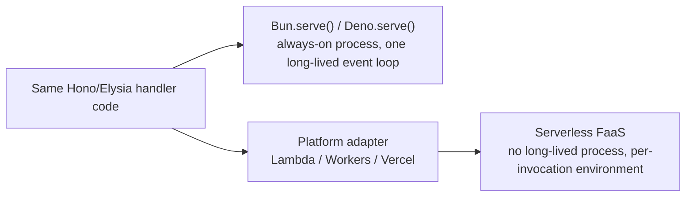
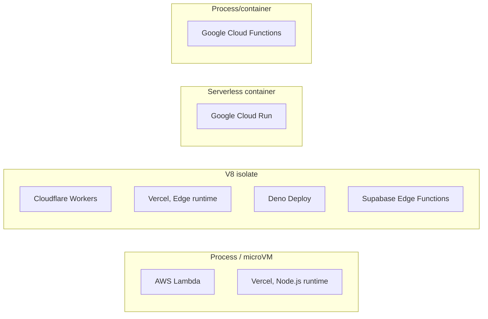

# JavaScript serverless runtimes

[docs/concepts/serverless-architecture.md](serverless-architecture.md) covers serverless
language-agnostic: FaaS mechanics, cold starts, isolation models. This
doc applies that vocabulary to the specific JS-capable platforms. For
the engine/host-API/runtime split each one builds on, see
[docs/concepts/javascript-runtimes.md](javascript-runtimes.md). For the `fetch`-handler
primitive most of them share, see [docs/concepts/javascript-web-servers.md](javascript-web-servers.md).

## Table of contents

- [The same framework, two worlds](#the-same-framework-two-worlds)
- [Where each platform lands](#where-each-platform-lands)
- [Platform notes](#platform-notes)
- [Comparison table](#comparison-table)
- [Why isolation model predicts npm compatibility](#why-isolation-model-predicts-npm-compatibility)
- [See also](#see-also)

## The same framework, two worlds

Hono and Elysia are written directly against `Request`/`Response`, so
the exact same handler code runs unmodified in two very different
places:

Nothing in the framework code needs to know which world it's in. What
changes is everything underneath: whether a process exists, whether
state survives between requests, and what host APIs are available.

## Where each platform lands

## Platform notes

**AWS Lambda**
- Handler shape is Lambda's own event/context object, not `Request`/`Response` — Express/Hono need an adapter (`serverless-http`, API Gateway, or a Function URL).
- Node.js gets **no SnapStart** cold-start mitigation; that feature covers Java, Python 3.12+, and .NET 8+ only, per [docs.aws.amazon.com/lambda/latest/dg/snapstart.html](https://docs.aws.amazon.com/lambda/latest/dg/snapstart.html).

**Cloudflare Workers**
- Handler is native `fetch(request)` — no adapter needed for any `Request`/`Response`-based framework.
- One running V8 engine hosts many sandboxed isolates; a new request just gets handed one, per [developers.cloudflare.com](https://developers.cloudflare.com/workers/reference/how-workers-works/).

**Vercel Functions — two runtimes under one name**
- **Node.js runtime**: process/microVM model, full Node compatibility, slower cold start.
- **Edge runtime**: "built on top of the V8 engine... isolated execution environments that don't require a container or virtual machine," per [vercel.com/docs/functions/runtimes](https://vercel.com/docs/functions/runtimes) — same family as Workers.
- Picking one is an architectural decision: full Node APIs vs. Workers-like cold-start speed.

**Deno Deploy**
- Same V8-isolate model as Workers. Deno already implements `fetch`/`Request`/`Response` natively, so `Deno.serve()` code deploys unchanged, no adapter.

**Supabase Edge Functions**
- V8-isolate, Deno-based (same engine as Deno Deploy), run alongside Supabase's BaaS products (hosted Postgres/auth/storage).
- Vendor's own guidance: "design for short-lived, idempotent operations," per [supabase.com/docs/guides/functions](https://supabase.com/docs/guides/functions).

**Google Cloud Functions vs. Cloud Run**
- **Cloud Functions**: classic FaaS, single handler, Node.js/Python/Go.
- **Cloud Run**: serverless *container* — any Node framework (Express, Hono, full Next.js) deploys as an ordinary container, full Node API access, no `fetch`-handler or Lambda-event shape required.

## Comparison table

| Platform | Isolation model | Handler shape | Node compatibility | Cold-start mitigation |
|---|---|---|---|---|
| AWS Lambda | Process/microVM | Lambda event/context, needs adapter | Full | None for Node (SnapStart excludes it) |
| Cloudflare Workers | V8 isolate | Native `fetch(request)` | Partial (compat flags) | Isolate model itself |
| Vercel, Node.js runtime | Process/microVM | Framework-native or Web handler | Full | Fluid compute's aggressive reuse |
| Vercel, Edge runtime | V8 isolate | `Request`/`Response` | Partial, Web-API-first subset | Isolate model itself |
| Deno Deploy | V8 isolate | Native `Request`/`Response` | Partial (Deno's Node-compat layer) | Isolate model itself |
| Supabase Edge Functions | V8 isolate | Native `Request`/`Response` | Partial (same Deno layer) | Isolate model itself |
| Google Cloud Functions | Process/container | Framework-specific | Full | Standard container cold start |
| Google Cloud Run | Serverless container | Whatever your app exposes | Full, any framework | Standard container cold start |

## Why isolation model predicts npm compatibility

Every V8-isolate platform above (Workers, Vercel Edge, Deno Deploy,
Supabase) ships a curated, Web-standard-first API surface, since there's
no Node process underneath to provide `fs`, native addons, or several
`Buffer`/`stream` internals. A package that reaches into those generally
runs fine on Lambda, Vercel's Node.js runtime, or Cloud Run, and
generally doesn't run unmodified on an isolate platform, regardless of
vendor. Same underlying fact as [docs/concepts/javascript-runtimes.md](javascript-runtimes.md)'s
"ownership by layer" table: the host API surface belongs to whatever's
running underneath your code, and an isolate's surface is structurally
smaller by design, not by oversight.

## See also

- [docs/concepts/serverless-architecture.md](serverless-architecture.md) — the language-agnostic FaaS vocabulary this doc applies.
- [docs/concepts/javascript-runtimes.md](javascript-runtimes.md) — engine/host-API/runtime split behind every platform above.
- [docs/concepts/javascript-web-servers.md](javascript-web-servers.md) — the `fetch`-handler primitive and frameworks that run across both worlds.
- [docs/concepts/javascript-event-loop.md](javascript-event-loop.md) — how the event loop behaves inside a single invocation.
