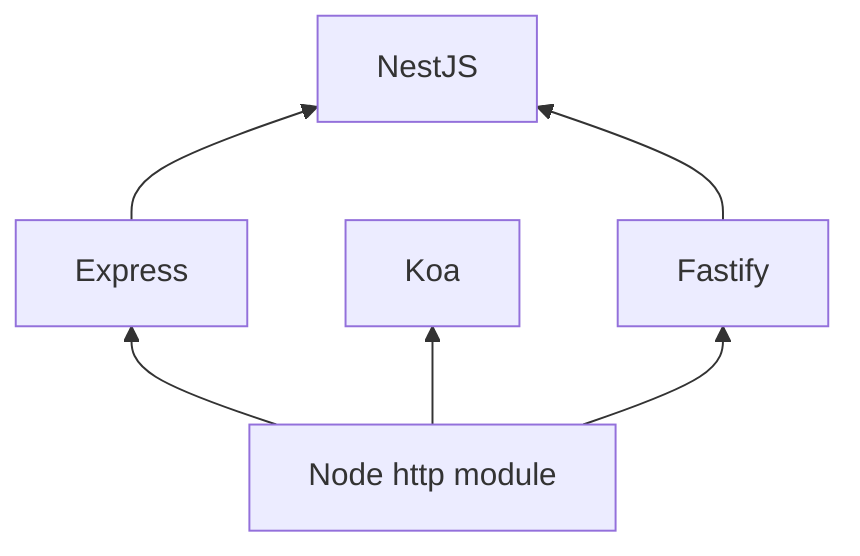
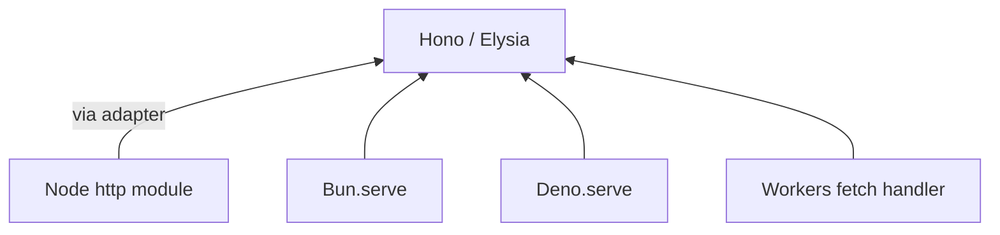
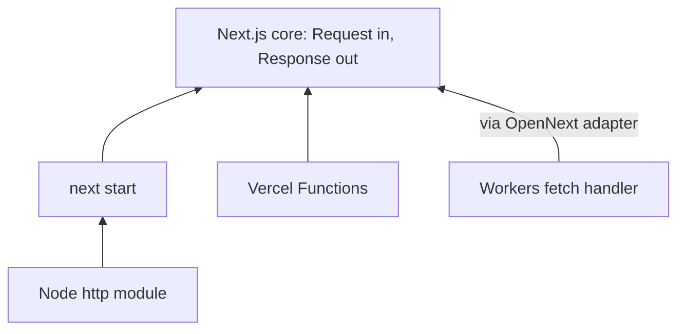
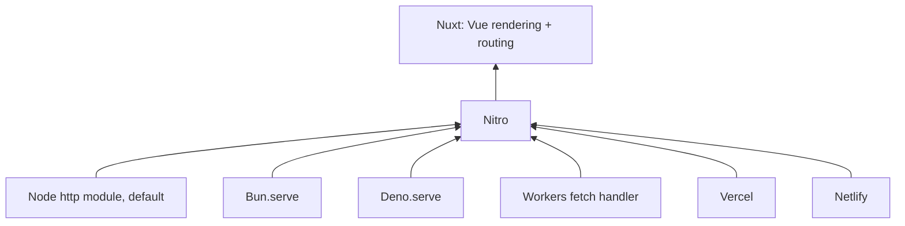
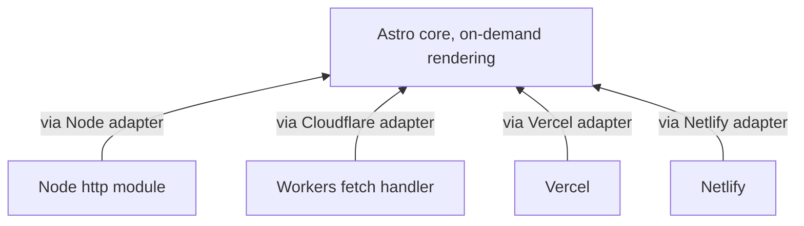
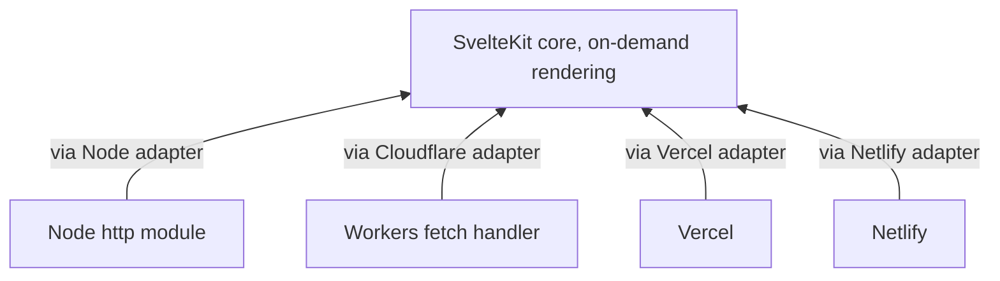
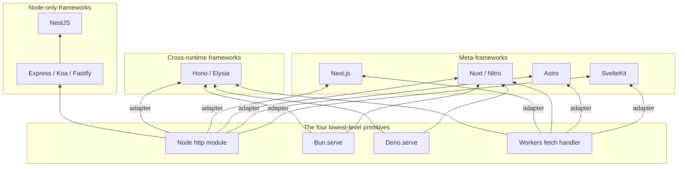

# JavaScript web servers

[docs/concepts/web-frameworks-and-servers.md](web-frameworks-and-servers.md) lays out a general idea: a
web server and a web framework are separate pieces of software, and in
most language ecosystems something formal sits between them, a published
contract, so any compliant server can run any compliant framework. That
doc places Node.js in the one category that skips this: the "loose, no
formal published contract" shape, where the server is just a built-in
part of the runtime and frameworks call into it directly.

The JavaScript ecosystem can feel like a wall of names because of that
missing contract: multiple runtimes, multiple low-level servers,
dozens of frameworks, and a handful of competing conventions for how they
all plug together. It looks like it should be an N-times-M-times-K
combinatorial mess. It mostly isn't, once you see it as a small number of
layers stacked on top of each other, and a small number of decisions
repeating at each layer. This doc builds that picture from the bottom up:
the actual low-level servers first (Node's `http` module, `Bun.serve()`,
`Deno.serve()`, and Cloudflare Workers' `fetch` handler), then the two
patterns frameworks use to sit on top of them (built for one runtime
specifically, or built to run on all of them), then the meta-frameworks
(Next.js, Nuxt, Astro, SvelteKit) that add page rendering on top of that
same split. It closes by running the picture in reverse, one diagram per
meta-framework, and by mapping the whole thing back onto the general
vocabulary from [docs/concepts/web-frameworks-and-servers.md](web-frameworks-and-servers.md). For
background on what Node, Deno, Bun, and Cloudflare's `workerd` are as
JavaScript runtimes in the first place (the engine each one embeds, the
language each is written in, how each one's event loop works), see
[docs/concepts/javascript-runtimes.md](javascript-runtimes.md), which this doc doesn't repeat.

## Table of contents

- [The lowest-level primitives](#the-lowest-level-primitives)
  - [Node's http module](#nodes-http-module)
  - [Bun.serve](#bunserve)
  - [Deno.serve](#denoserve)
  - [Cloudflare Workers' fetch handler](#cloudflare-workers-fetch-handler)
- [Why there's no shared contract across primitives](#why-theres-no-shared-contract-across-primitives)
- [WinterTC and the Fetch API convergence](#wintertc-and-the-fetch-api-convergence)
- [The Node-only framework stack](#the-node-only-framework-stack)
  - [Express](#express)
  - [Koa](#koa)
  - [Fastify](#fastify)
  - [NestJS](#nestjs)
- [The cross-runtime framework stack](#the-cross-runtime-framework-stack)
  - [Hono](#hono)
  - [Elysia](#elysia)
- [Meta-frameworks add rendering to the mix](#meta-frameworks-add-rendering-to-the-mix)
  - [Next.js](#nextjs)
  - [Nuxt and Nitro](#nuxt-and-nitro)
  - [Astro](#astro)
  - [SvelteKit](#sveltekit)
  - [Other meta-frameworks worth knowing by name](#other-meta-frameworks-worth-knowing-by-name)
- [The full picture](#the-full-picture)
- [A Bun, Hono, and Docker Compose case study](#a-bun-hono-and-docker-compose-case-study)
  - [Concurrency model and the event loop](#concurrency-model-and-the-event-loop)
  - [Threads and parallelism inside one container](#threads-and-parallelism-inside-one-container)
  - [Docker and Compose in this picture](#docker-and-compose-in-this-picture)
  - [Scalability in rough terms](#scalability-in-rough-terms)
- [Benchmark evidence and its limits](#benchmark-evidence-and-its-limits)
- [Tying it together](#tying-it-together)

## The lowest-level primitives

Everything else in this doc, every framework and every meta-framework, is
ultimately just code layered on top of one of four things. Each of these
is a genuine primitive: the actual piece of software that owns a socket
or receives a platform's raw incoming request, with nothing underneath it
but the operating system or the hosting platform itself.

### Node's http module

Node ships one built-in module for this, `http`. It owns the socket and
turns raw incoming bytes into a request object and a response object your
code writes to directly, described in Node's own docs as something that
"deals with stream handling and message parsing only," per
[nodejs.org/api/http.html](https://nodejs.org/api/http.html):

```javascript
const http = require('node:http');

const server = http.createServer((req, res) => {
  res.writeHead(200, { 'Content-Type': 'text/plain' });
  res.end('Hello from Node');
});

server.listen(3000);
```

Look closely at the shape of that callback, since it's the detail the
rest of this doc keeps coming back to: it receives **two separate
objects**, `req` and `res`, and returns nothing at all. You send a
response by *mutating* `res`, calling `.writeHead()` and then `.end()`
on it, and Node watches that object to know when you're done. Compare
that to the two primitives below, which both take **one object in** and
**return one object out**, no mutation involved. This shape predates the
web's own Fetch API standard by years, which turns out to be the single
most consequential fact in this whole doc, since almost every piece of
ecosystem fragmentation covered below traces back to it.

### Bun.serve

Bun ships `Bun.serve()`, a single function that starts a complete HTTP
server directly, described in Bun's own docs as letting you "start a
high-performance HTTP server in Bun," per
[bun.sh/docs/api/http](https://bun.sh/docs/api/http). Each handler
receives a standard Web API `Request` object and returns a standard
`Response` object, the exact same classes browsers expose to
client-side JavaScript:

```javascript
const server = Bun.serve({
  fetch(req) {
    return new Response("Hello from Bun");
  },
});
```

### Deno.serve

Deno takes the same approach, shipping `Deno.serve()` directly rather
than a low-level stream module. Deno's own docs describe it as "a
built-in HTTP server API," one that "works with the web-standard
`Request` and `Response` objects," per
[docs.deno.com](https://docs.deno.com/runtime/fundamentals/http_server/):

```javascript
Deno.serve((_req) => {
  return new Response("Hello, World!");
});
```

### Cloudflare Workers' fetch handler

Cloudflare Workers aren't Node, Bun, or Deno; they run on Cloudflare's
own JavaScript runtime, `workerd`, covered on the engine/runtime level in
[docs/concepts/javascript-runtimes.md](javascript-runtimes.md) (V8 isolates, not one process per
instance). They're included here because every framework and
meta-framework in this doc treats them as a first-class deployment
target, and because their primitive is the cleanest possible illustration
of "the Fetch API and nothing else." A Worker's whole job is one exported
function: "incoming HTTP requests to a Worker are passed to the `fetch()`
handler as a `Request` object. To respond to the request with a response,
return a `Response` object," per
[developers.cloudflare.com](https://developers.cloudflare.com/workers/runtime-apis/handlers/fetch/):

```javascript
export default {
  async fetch(request) {
    return new Response("Hello from a Worker");
  },
};
```

There's no separate server object to configure at all, the platform
itself calls your function directly.

The name "fetch handler" is worth pausing on, since it's easy to read
`fetch` as a client-only word, "the thing that sends a request," and get
stuck on why a server-side handler would share that name. The naming is
inherited, not descriptive of what your code does. It traces back to a
browser feature that predates all of this: **Service Workers**, which let
a page's background script intercept the browser's own outgoing network
requests, for example to serve a cached response when offline. A Service
Worker listens for a `fetch` event, which fires "when the main app thread
makes a network request," and answers it by calling `respondWith()` with
a `Response`, which "enables the service worker event handler to provide
the response that is returned to the request," per
[MDN's ServiceWorkerGlobalScope: fetch event docs](https://developer.mozilla.org/en-US/docs/Web/API/ServiceWorkerGlobalScope/fetch_event).
So even in the browser, the `fetch` event was never about sending, it was
about **intercepting a request and answering it with a `Response`**,
exactly the job a server does. Cloudflare Workers' original syntax,
still supported today, makes that lineage explicit rather than
coincidental:

```javascript
addEventListener('fetch', event => {
  event.respondWith(new Response("Hello from a Worker"));
});
```

Same event name, same `respondWith(Response)` pattern, just repurposed so
a Worker intercepts an actual incoming HTTP request instead of a browser
page's outgoing one. The modern `export default { fetch(request) {} }`
form shown above is newer and more common, but it's the same underlying
convention: the handler kept the name "fetch" because it plays the
*answering* role in the same request/response contract the browser's own
`fetch()` plays the *asking* role in, not because the handler itself
fetches anything.

Three of these four primitives (Bun, Deno, Workers) already speak the
same language: a function that takes a `Request` and returns a
`Response`. Node's is the odd one out, and that gap is exactly what the
next two sections are about.

## Why there's no shared contract across primitives

Different JavaScript runtimes grew up separately, and each one ended up
inventing its own version of basic things: how you read an incoming
request's body, how you make an outgoing HTTP call, how crypto or random
values work. Nobody coordinated any of it, so even though Node, Bun,
Deno, and Cloudflare Workers are all "just JavaScript," code written for
one doesn't necessarily run on another, because the primitives above are
shaped differently underneath. Three of the four primitives converged on
the same shape somewhat by accident, by picking up the browser's Fetch
API after it existed as a standard; Node's `http` module simply predates
that standard and was never redesigned around it.

## WinterTC and the Fetch API convergence

That friction turned out to be real enough that a group of runtime
maintainers formed their own standards body to fix it: **WinterTC**,
formerly known as WinterCG, now a formal technical committee under Ecma
International, the same standards body that publishes the JavaScript
language spec itself. Its own site states its purpose plainly: building
"some level of API interoperability across server-side JavaScript
runtimes, especially for APIs that are common with the web," per
[wintertc.org](https://wintertc.org/). Its main concrete deliverable is
what the group calls the **minimum common API**, a shared set of ordinary
web APIs (`fetch`, `URL`, `Request`, `Response`, `Crypto`) that every
compliant runtime agrees to implement the same way. (For the full history
of the WinterCG-to-WinterTC move, see
[wintertc.org/faq](https://wintertc.org/faq); it's not essential to the
concept here.)

Worth being precise about what this does and doesn't standardize, since
it's easy to overstate the parallel to WSGI or the Servlet API from
[docs/concepts/web-frameworks-and-servers.md](web-frameworks-and-servers.md). Those two define how a
server hands a parsed request over to a framework. WinterTC's work sits
one level below that: it standardizes what a request and a response look
like as objects, not a formal handoff mechanism between a specific server
process and a specific framework process. So Node still has no
WSGI-style swappable contract in the strict sense. What it gains through
WinterTC is simpler, but still powerful enough on its own: agreement on
what a request and a response actually are. That agreement is the load-bearing
fact for everything from here on. Every framework and meta-framework
below makes one core decision: build against Node's native shape, or
build against the Fetch API shape three of the four primitives already
speak natively.

## The Node-only framework stack

Before Hono, Elysia, Bun, or Deno entered the picture, Node already had a
mature stack of frameworks built specifically around its own `http`
module, and these are still what the overwhelming majority of production
JavaScript backends actually run today. None of them were designed with
cross-runtime portability in mind, which is the whole reason they belong
in this section rather than the next one.

### Express

The oldest and by far the most widely used of the four, describing
itself as a "fast, unopinionated, minimalist web framework for Node.js,"
per [expressjs.com](https://expressjs.com/). It calls Node's `http`
module directly. Every request and response object Express hands to your
route handlers is Node's own native request/response object with extra
convenience methods layered on top, not a separate object type.

### Koa

Built by the same team that originally created Express, aiming to be "a
smaller, more expressive, and more robust foundation for web applications
and APIs," per [koajs.com](https://koajs.com/). Its own docs are explicit
that it still wraps Node's `http` module underneath: `app.listen()` is
"simply sugar" for calling `http.createServer(app.callback())` directly
(same source). The main difference from Express is middleware style. Koa
builds its middleware around `async`/`await` from the start, rather than
the callback-based chain Express originally used.

### Fastify

Targets raw throughput specifically, describing itself as "a fast,
low-overhead web framework for Node.js," per
[github.com/fastify/fastify](https://github.com/fastify/fastify), and
also built on Node's `http` module rather than a separate low-level
server.

### NestJS

Extremely common in TypeScript-heavy backend codebases specifically.
Rather than replacing Express or Fastify, NestJS is a structured,
TypeScript-first layer built on top of one of them. Its own README states
plainly: "under the hood, Nest makes use of Express, but also provides
compatibility with a wide range of other libraries, like Fastify," per
[github.com/nestjs/nest](https://github.com/nestjs/nest). So NestJS isn't
a fourth HTTP server implementation, it's an opinionated application
structure (dependency injection, decorators, modules) sitting on top of
whichever of the two it's configured to use underneath.



A practical wrinkle worth naming now, since it comes up the moment you
ask "does Express run on Bun": yes, but not because Express changed.
Bun's own docs implement `node:http` as "fully implemented," and
explicitly name Express as one of the packages that "work with Bun," per
[bun.sh/docs/runtime/nodejs-apis](https://bun.sh/docs/runtime/nodejs-apis).
Bun did the work here, by shipping its own compatible implementation of
Node's `http` module, so Express, Koa, Fastify, and NestJS all keep
thinking they're talking to real Node. That's a fundamentally different
kind of portability than the next section's frameworks have, where the
framework itself, not the runtime pretending to be something else, is
what makes cross-runtime support possible.

## The cross-runtime framework stack

Hono and Elysia took the other path: instead of writing against Node's
native shape and hoping runtimes stay compatible, they wrote their core
logic directly against the Fetch API's `Request`/`Response` shape, the
same shape `Bun.serve()`, `Deno.serve()`, and Cloudflare Workers already
speak natively.

### Hono

Hono's own docs open with exactly this claim: "Hono... is a small,
simple, and ultrafast web framework built on Web Standards," and "it
works on any JavaScript runtime: Cloudflare Workers, Fastly Compute,
Deno, Bun, Vercel, Netlify, AWS Lambda, Lambda@Edge, and Node.js," per
[hono.dev/docs](https://hono.dev/docs/). A Hono route handler receives
and returns the exact same `Request`/`Response` objects the primitives
section above already introduced. The one primitive that genuinely needs
an extra piece is Node, because Node's `http` module predates the Fetch
API and doesn't speak `Request`/`Response` natively; Hono covers that gap
with what its docs call **a Node.js adapter**, a small translation layer
(`@hono/node-server`) that converts between Node's native request/response
objects and the Fetch API shape Hono's core code expects, so "by using a
Node.js adapter, Hono works on Node.js" too, per the same
[hono.dev/docs](https://hono.dev/docs/) page. An **adapter**, in this
context, just means a small piece of glue code that translates one
primitive's native request/response shape into the Fetch API shape a
cross-runtime framework's core logic actually expects, so the framework
itself never has to know which primitive it's running on.

### Elysia

Takes the same approach from the opposite direction: it started as "an
ergonomic web framework for building backend servers with Bun," per
[elysiajs.com](https://elysiajs.com/at-glance.html), meaning Bun is its
primary, most tightly optimized target, and it has since grown adapters
outward to other environments. Its own docs state that Elysia supports
Node.js, Deno, and Cloudflare Workers alongside Bun, framing the reason
directly in terms of the standards effort above: "being WinterTC
compliant allows you to deploy Elysia servers on" multiple platforms, per
the same page.



The double meaning of "native" versus "via an adapter" in that diagram is
the whole mechanical story so far: three of the four primitives already
speak the shape these frameworks are written in, so they run there
directly. Node doesn't, so a small adapter sits in between and
translates. Either way, the framework's own routing and application code
never has to change per primitive, which is the practical, working
substitute for a WSGI-style formal contract that this ecosystem never
adopted for Node's `http` module, and never needed to build for the other
three, because they adopted the browser's existing shape instead of
inventing a new one.

## Meta-frameworks add rendering to the mix

Everything above is a routing library: request in, response out, that's
the whole job. Next.js, Nuxt, Astro, and SvelteKit are doing a genuinely
different job on top of that same split. They also have to render UI
(server rendering, static generation, component islands), manage a build
pipeline, and handle page routing alongside plain API routing. Once you
look inside them, though, they reproduce the exact same primitive/adapter
split covered above, and nearly all of them have independently converged
on the same answer: build the core around `Request` in, `Response` out,
and ship a separate, official adapter per deployment target. That
repetition is itself the point. It's the same two-layer pattern from the
sections above (a portable core, plus one adapter per primitive),
applied to a bigger job.

### Next.js

Next.js's own docs are explicit that "Route Handlers allow you to create
custom request handlers for a given route using the Web `Request` and
`Response` APIs," per
[nextjs.org](https://nextjs.org/docs/app/api-reference/file-conventions/route).
Every handler literally takes a standard `Request` and returns a
standard `Response`. Deployment is flexible: self-host it with `next
start`, which runs on Node's `http` module directly, deploy it to
Vercel (built by the same company, and Next.js's most tightly integrated
target), or use a community adapter such as OpenNext to target Cloudflare
Workers.



### Nuxt and Nitro

Nuxt, the Vue equivalent of Next.js, doesn't handle serving itself. It
delegates entirely to **Nitro**, a separate server engine that describes
itself as "a full-stack server framework, compatible with any runtime and
any deployment target," per [nitro.build](https://nitro.build/). Nitro's
own docs ship dedicated documentation for Node.js, Bun, and Deno as
runtime targets, name Node.js as the default production output preset,
and support zero-config deployment to numerous hosting providers,
including Vercel, Netlify, Cloudflare, AWS Amplify, Azure, and Firebase,
per [nitro.build/deploy](https://nitro.build/deploy). Nitro is, in effect,
the most aggressively cross-primitive piece of software in this entire
doc, more so than Hono or Elysia, since it targets not just multiple
runtimes but multiple hosting providers' own deployment formats too.



### Astro

Astro's own docs are explicit that "before deploying your Astro site
with on-demand rendering enabled, make sure you have installed the
appropriate adapter to your project dependencies," per
[docs.astro.build](https://docs.astro.build/en/guides/deploy/), with
separate official adapters for Node, Cloudflare, Netlify, and Vercel.
Astro's most distinctive option, worth calling out because it's not
available in quite the same form for the other three: pure static
output. If a site has no server-rendered routes at all, Astro needs no
adapter and no server-side primitive whatsoever, it just builds plain
HTML files that any static file host can serve. That's the clearest
possible illustration that "the server" as a concept only exists at all
once there's a request that needs to be handled at runtime; a fully
static site has removed that requirement entirely.



This diagram only covers on-demand rendering, the case where a real
request needs to be answered at runtime, which is why it's drawn the same
way as every other framework's diagram in this doc: primitives at the
bottom, adapters as labeled edges, the framework's core on top. Static
output isn't a fifth branch off that same core, it's a separate mode that
bypasses this entire diagram: Astro runs once at build time and produces
plain files, with no primitive, no adapter, and no request-time server
involved at all. That's why it's left out of the diagram rather than
drawn as another arrow into `ASTCORE`, adding it there would wrongly
suggest static output is just another deployment target reached through
the same running core, when it's actually the one case where none of
this machinery runs at request time.

### SvelteKit

SvelteKit states its own architecture about as directly as any project
in this doc could: "fundamentally, a SvelteKit app is a machine for
turning a `Request` into a `Response`," per
[svelte.dev](https://svelte.dev/docs/kit/web-standards). Its docs
describe adapters as "small plugins that take the built app as input and
generate output for deployment," per
[svelte.dev/docs/kit/adapters](https://svelte.dev/docs/kit/adapters),
with official adapters for Node, Cloudflare (Workers and Pages), Netlify,
Vercel, and, like Astro, a fully static output option that needs no
server-side primitive at all.



Same reasoning as Astro's diagram above: this only covers on-demand
rendering. SvelteKit's static output option is left off the diagram for
the same reason, it bypasses this whole picture at build time rather than
adding a fifth branch into `SKCORE`.

### Other meta-frameworks worth knowing by name

The same two-layer pattern (a portable core built on `Request`/`Response`,
plus one official adapter per deployment target) shows up again in
**Remix** (now merged into React Router as of React Router v7) and
**SolidStart** (the Solid.js equivalent of these four). If you encounter
either one, expect the same shape already covered above: a rendering
core, a handful of official adapters, and support for roughly the same
set of hosting targets named throughout this section. This doc doesn't
verify their specifics beyond that, since the pattern itself, not each
project's exact adapter list, is the useful thing to carry forward.

## The full picture

Putting every layer covered so far on one diagram, bottom to top:



Two things fall out of looking at it this way. First, Node's `http`
module is the single most connected node in the whole diagram, precisely
because it's the one primitive every framework and meta-framework has to
specifically accommodate rather than use natively. Second, Nitro is the
only piece of software here that connects to all four primitives
directly, which is exactly why Nuxt gets described as portable "to any
runtime and any deployment target" rather than to a specific named list.

## A Bun, Hono, and Docker Compose case study

Everything above has been the general map. This section applies it to one
specific, common stack choice: Bun as the runtime, Hono as the framework,
deployed as a container managed by Docker Compose. The point isn't that
this combination is special, it's that walking through it concretely
shows exactly how the abstract layers from the rest of this doc turn into
real answers about concurrency, threading, and scale.

### Concurrency model and the event loop

Hono contributes zero concurrency behavior of its own. It's a routing and
middleware layer sitting on top of whatever `fetch` handler Bun calls per
request, covered earlier in
[Hono](#hono). Every concurrency property this stack has comes entirely
from Bun underneath it. Bun is single-threaded for JavaScript execution
by default and runs one event loop per process, the same model #3
described in [docs/concepts/concurrency-models.md](concurrency-models.md). Each incoming request
to `Bun.serve()` becomes an async task on that one event loop. Awaiting a
database call, an outbound HTTP request, or file I/O inside a Hono
handler hands control back to the event loop so other in-flight requests
can keep progressing meanwhile, concurrency without parallelism, exactly
as that doc describes it.

The failure mode is the same one too: if a Hono handler runs real,
synchronous CPU work without ever awaiting, hashing something expensive,
parsing a huge payload synchronously, a tight loop, it blocks that one
event loop for every other in-flight request on the process. That's the
"cooperative scheduling means nothing is preemptive" cost named directly
in [docs/concepts/concurrency-models.md](concurrency-models.md), and it applies to this stack
exactly as written there.

### Threads and parallelism inside one container

Bun does ship genuine OS-thread-backed parallelism, through its `Worker`
API: "you start and communicate with a new JavaScript instance running on
a separate thread while sharing I/O resources with the main thread," per
[bun.sh/docs/api/workers](https://bun.sh/docs/api/workers). Each `Worker`
gets its own JS heap and its own event loop, and talks to the main thread
through `postMessage`, using the structured clone algorithm, not shared
memory by default. That's the tool for CPU-bound work specifically: hand
the expensive computation to a `Worker`, let the main event loop keep
serving other requests while it runs on another core, and receive the
result back as a message when it's done.

Hono has no involvement in any of this. Spawning workers, or not, is
entirely a decision made in your own Bun code, below Hono in the stack.
Bun's own current `Bun.serve()` documentation also doesn't describe an
automatic multi-core clustering mode, nothing equivalent to Node's
`cluster` module that would let one process transparently spread ordinary
request handling across several cores. So using more than one core for
everyday request throughput, as opposed to one specific CPU-bound task
you've explicitly offloaded to a `Worker`, isn't a single-process feature
at all. It's handled one level up, which is where Docker and Compose
enter the picture.

### Docker and Compose in this picture

One container running a Bun process is exactly one event loop, plus
however many `Worker` threads that process chooses to spawn itself, all
sharing whatever CPU allocation the container has been given. Scaling
this horizontally, the standard pattern, means running multiple replicas
of that same container (plain Compose's `--scale` flag, or
`deploy.replicas` under Swarm mode) behind a reverse proxy that balances
requests across them, the same role Caddy plays in this project's own
setup, covered in [docs/concepts/caddy.md](caddy.md), or Nginx and Traefik would
play elsewhere. Mechanically, this is the same idea as the Gunicorn
worker-process pool covered in [docs/concepts/python-web-servers.md](python-web-servers.md),
just implemented as separate containers coordinated by Compose or an
orchestrator, instead of one process manager forking children on a single
machine. See [docs/concepts/docker.md](docker.md) and [docs/concepts/docker-compose.md](docker-compose.md)
for the general mechanics of containers and Compose themselves; this
section only covers what's specific to running a Bun/Hono process inside
one.

### Scalability in rough terms

For I/O-bound workloads, the common case, mostly waiting on a database,
an external API, or the network, one Bun process can hold open a large
number of concurrent, mostly-idle connections cheaply, the same
C10K-solving property the event-loop model gives every runtime covered in
[docs/concepts/concurrency-models.md](concurrency-models.md). Bun's own published numbers,
already covered in the benchmarks section below, put a bare `Bun.serve()`
handler around 160,000 simple requests per second on their own hardware.
Treat that as a ceiling for a trivial handler on strong hardware, not a
figure any real Hono application with a database behind it will
approach.

For CPU-bound workloads, one Bun process scales only as far as the
`Worker` threads you explicitly spawn, capped by however many CPU cores
the container is actually allowed to use. Past that point, it's the same
wall every process hits: more work than cores.

For overall production scale, the practical lever is almost always
horizontal: more container replicas of the same Bun/Hono image, not
fewer, bigger, more-threaded processes. That's the same lever Gunicorn
workers pull for Python and thread pools pull for Java, just expressed as
container replicas instead of OS processes or OS threads inside one
process.

## Benchmark evidence and its limits

Benchmarks in this space are genuinely contested, hardware-dependent, and
frequently published by the projects they favor, so the goal here is to
show real, sourced numbers while being explicit about what each one
actually measures, rather than presenting any single figure as a settled
ranking.

| Source | What it actually measures | Numbers | Caveat |
|---|---|---|---|
| [Hono's own benchmarks](https://hono.dev/docs/concepts/benchmarks) | Router throughput, 12 registered routes | Cloudflare Workers: Hono ~402,820 ops/sec vs. itty-router ~212,598. Deno: Hono ~136,112 req/sec vs. next-best ~103,214 | Routing only, says nothing about database calls, JSON serialization, or middleware overhead |
| [Elysia's 1.3 release post](https://elysiajs.com/blog/elysia-13) | Schema validation throughput, version over version | Elysia 1.2 ~49,000 req/sec to Elysia 1.3 ~77,000 req/sec | Elysia against earlier Elysia, not against Hono, Fastify, or Express |
| [Bun's own http docs](https://bun.sh/docs/api/http) | Plaintext requests/sec, `Bun.serve()` vs. Node's `http` | Bun ~160,000 vs. Node 16 ~64,000 (Bun's own "~2.5x" claim) | Vendor-published, a trivial handler on Bun's own hardware |
| [Fastify's own README](https://github.com/fastify/fastify) | Plaintext requests/sec, same benchmark conditions | Fastify ~77,193 vs. Express ~14,200 | Vendor-published, same caveat as the Bun number above |
| [TechEmpower Framework Benchmarks](https://github.com/TechEmpower/FrameworkBenchmarks) | Cross-language, cross-framework suite (plaintext, JSON, database queries) | No single figure, dozens of frameworks across many test types | Independent, but methodology-heavy; compare specific frameworks on their own site rather than quoting one number |
| [the-benchmarker/web-frameworks](https://github.com/the-benchmarker/web-frameworks/discussions/8088) | Raw HTTP round-trip and routing overhead, many frameworks including Node/Bun/Deno | No fixed figure here | Maintainer's own advice: read the ratio between frameworks in one run, not the absolute numbers, which shift with hardware, load generator settings, and version |

The honest summary across all of these: Bun and Deno's native servers are
consistently reported faster than Node's `http` module, and Fastify is
consistently reported faster than Express, in each project's own tests.
Exactly how much faster, and whether that gap survives contact with a
real application doing real database work, depends heavily on which
benchmark, which version, and which hardware you're looking at. None of
the sources above claim otherwise about their own numbers.

## Tying it together

Node's own `http` module really is what
[docs/concepts/web-frameworks-and-servers.md](web-frameworks-and-servers.md) calls it: a low-level
primitive with no independently published, swappable contract sitting
above it, unlike Python's WSGI/ASGI, Ruby's Rack, or Java's Servlet API.
That looseness turned out to be a real, acknowledged source of friction
once the JavaScript ecosystem grew beyond a single runtime, serious
enough that runtime maintainers formed a dedicated standards body,
WinterTC, specifically to converge server-side JavaScript environments on
one shared shape, the browser's own Fetch API `Request` and `Response`
objects.

That single decision, Fetch API shape versus Node-native shape, is what
actually organizes everything covered in this doc, more than any list of
framework names does. Express, Koa, Fastify, and NestJS chose Node's
native shape, so they run on other primitives only through compatibility
shims (Bun pretending to be Node) rather than natively. Hono and Elysia
chose the Fetch API shape, so they run natively on three of the four
primitives and need only a small adapter for Node. Next.js, Nuxt, Astro,
and SvelteKit all independently arrived at the same Fetch API decision
for their own core routing, then layered page rendering and a
per-platform adapter system on top. That's the real answer to the
"NxMxKxL" feeling from the start of this doc: the runtimes multiply, the
frameworks multiply, but almost all of that multiplication collapses onto
one binary choice (which shape does the framework's core speak) crossed
with one additional job (routing only, or routing plus rendering), not a
genuinely unbounded combinatorial space.

Mapped onto [docs/concepts/web-frameworks-and-servers.md](web-frameworks-and-servers.md)'s own three
categories: Node.js alone sits in that doc's "loose, no formal published
contract" category. Bun, Deno, and Cloudflare Workers don't neatly fit
any of the three, since they didn't publish an independent contract the
way WSGI or Rack did, nor did they just rely on a small standard-library
interface the way Go did. What they did instead, converging on an
already-existing browser standard as their native server interface, is
closer to a fourth pattern: adopting someone else's contract rather than
publishing a new one. On that same doc's sync-versus-async table, every
runtime, framework, and meta-framework in this entire doc is
asynchronous and event-loop-based by design; there's no synchronous,
thread-per-request option anywhere in this landscape the way Puma or a
traditional Java servlet container offer. See
[docs/concepts/javascript-event-loop.md](javascript-event-loop.md) for why that's true at the
language and runtime level, independent of which server or framework
sits on top.

See [docs/concepts/javascript-runtimes.md](javascript-runtimes.md) for the engine-versus-runtime
distinction underlying Node, Deno, and Bun in the first place,
[docs/concepts/web-frameworks-and-servers.md](web-frameworks-and-servers.md) for the general
server/framework/contract vocabulary this doc builds on, and
[docs/concepts/python-web-servers.md](python-web-servers.md) for how Python's own version of
this problem (WSGI, ASGI, Gunicorn, Uvicorn) was solved with a formally
published, independent contract from early on, rather than a
standards-body convergence effort arriving after the fact the way
WinterTC did for JavaScript.

Everything in this doc assumes the always-on server model: a process
binds a port and keeps running. [docs/concepts/javascript-serverless.md](javascript-serverless.md)
covers the other shape, the same frameworks and the same `Request`/
`Response` primitive deployed instead to AWS Lambda, Cloudflare Workers,
Vercel Functions, and other serverless platforms, and
[docs/concepts/serverless-architecture.md](serverless-architecture.md) covers the language-agnostic
FaaS vocabulary (cold starts, isolation models) that doc builds on.
