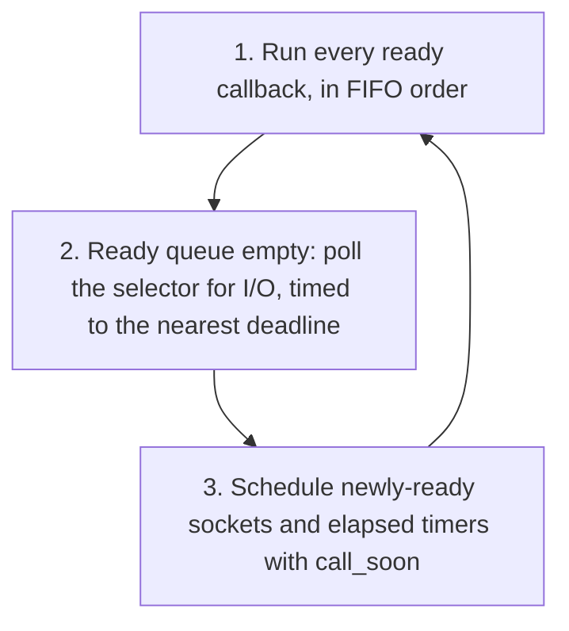

# Python's event loop, and how it compares to JavaScript's

[docs/concepts/python-concurrency.md](python-concurrency.md) covers `asyncio` at the API level:
coroutines, `Task`, `gather()`. This doc goes one level deeper, into the
event loop itself, the thing actually running underneath all of that. It
sets up a direct, sourced comparison with
[docs/concepts/javascript-event-loop.md](javascript-event-loop.md), since the two loops share a lot
of vocabulary but differ in one important structural way.

## Starting the loop: `asyncio.run()`

Almost all `asyncio` code starts the same way. Per the
[official docs](https://docs.python.org/3/library/asyncio-runner.html):

> "This function runs the awaitable, taking care of managing the asyncio
> event loop, finalizing asynchronous generators, and closing the
> executor... This function should be used as a main entry point for
> asyncio programs, and should ideally only be called once."

So `asyncio.run(main())` creates a fresh event loop, runs your top-level
coroutine in it, and tears the loop down when it finishes. Underneath
that convenience wrapper are two lower-level methods worth knowing about
directly, since they explain what "running the loop" actually means. Per
the [event loop docs](https://docs.python.org/3/library/asyncio-eventloop.html):

- `run_until_complete()`: "Run until the future has completed."
- `run_forever()`: "Run the event loop until `stop()` is called."

`asyncio.run()` is built on top of these. It's the one you'll use in
practice; the two above are what it's doing internally.

## The ready queue: how callbacks actually get scheduled

This is the part that matters most for the JavaScript comparison later.
`asyncio`'s event loop keeps a queue of callbacks that are ready to run,
and three methods add work to it. Per the same event loop docs:

- **`loop.call_soon(callback)`**: "Schedule the callback to be called
  with args arguments at the next iteration of the event loop." Critically:
  "Callbacks are called in the order in which they are registered. Each
  callback will be called exactly once." That's a plain FIFO queue, first
  in, first out, nothing fancier.
- **`loop.call_later(delay, callback)`**: "Schedule callback to be called
  after the given delay number of seconds."
- **`loop.call_at(when, callback)`**: same idea, but at an absolute
  timestamp instead of a delay from now.

There's also a lower-level pair for watching sockets directly, per the
[low-level API index](https://docs.python.org/3/library/asyncio-llapi-index.html):
`loop.add_reader()` and `loop.add_writer()`, described as starting to
"watch a file descriptor for read/write availability." This is the exact
epoll/kqueue readiness-notification layer covered in
[docs/concepts/concurrency-models.md](concurrency-models.md)'s appendix, just one level below
where application code normally touches it.

This is also where the fd-to-callback mapping is actually documented, not
just implied. Per the [event loop docs](https://docs.python.org/3/library/asyncio-eventloop.html):

> "Start monitoring the *fd* file descriptor for read availability and
> invoke *callback* with the specified arguments once *fd* is available
> for reading. Any preexisting callback registered for *fd* is cancelled
> and replaced by *callback*."

That's a documented, one-to-one association between a specific file
descriptor and a specific callback, kept internally by the loop.
`asyncio`'s own internals use exactly this mechanism to know when a
socket a coroutine is waiting on is ready, then use `call_soon()` to
actually resume that coroutine.

## Where a resumed coroutine fits into that queue

Here's the fact that sets up the whole JavaScript comparison. When a
coroutine `await`s a `Future` (or a `Task`, which is a kind of `Future`)
that isn't done yet, something has to wake that coroutine back up once the
result is ready. Per the [`Future` docs](https://docs.python.org/3/library/asyncio-future.html):

> "Callbacks registered with `asyncio.Future.add_done_callback()` are not
> called immediately. They are scheduled with `loop.call_soon()` instead."

So resuming a paused coroutine isn't special. It's just another callback,
added to the exact same FIFO queue as a `call_soon()`'d timer callback or
anything else. There's no separate, higher-priority lane for "a coroutine
that's ready to continue" the way JavaScript has one for microtasks. This
is confirmed structurally, not just for this one case, by how the docs
describe running Tasks in general
([Developing with asyncio](https://docs.python.org/3/library/asyncio-dev.html)):

> "An event loop runs in a thread (typically the main thread) and executes
> all callbacks and Tasks in its thread. While a Task is running in the
> event loop, no other Tasks can run in the same thread. When a Task
> executes an `await` expression, the running Task gets suspended, and the
> event loop executes the next Task."

"The next Task" here just means whatever's next in that same FIFO
callback queue. One queue, one order, no tiers.

## One iteration, traced through

The official docs don't publish a formal step-by-step breakdown of a
single loop iteration the way the WHATWG HTML spec does for the browser
(covered in [docs/concepts/javascript-event-loop.md](javascript-event-loop.md)). The diagram below
is my own illustration, built directly from the API behavior quoted
above, not a reproduction of anything Python's docs state as a numbered
algorithm.



## The big structural difference from JavaScript: one queue, not two

[docs/concepts/javascript-event-loop.md](javascript-event-loop.md) covers JavaScript's rule in
detail: there are two separate queues, a microtask queue and a macrotask
(task) queue, and the microtask queue is always fully drained, including
anything it adds to itself while draining, before a single macrotask is
allowed to run. That's a hard priority guarantee: a `Promise.then()`
callback always runs before a `setTimeout(fn, 0)` callback, no matter
what, every time.

Python's `asyncio` doesn't have that split. There's one ready queue, FIFO,
covered above. A resumed coroutine and a `call_soon()`'d plain callback
and a `call_later(0, ...)` timer callback are all just entries in the same
queue, ordered by when they were scheduled, not by category. Nothing in
`asyncio`'s model gives "a coroutine waking up" priority over "a timer
firing," the way JavaScript gives Promise callbacks priority over
`setTimeout`.

Concretely, in JavaScript, this always holds, guaranteed by spec:

```javascript
setTimeout(() => console.log("timer"), 0);
Promise.resolve().then(() => console.log("promise"));
// prints "promise" then "timer", every single time
```

Python has no equivalent guarantee. Whichever callback was scheduled
first, or whose deadline arrives first, runs first. There's no rule that
says "a resumed coroutine always wins."

## Blocking the loop: the same failure mode, described directly

Both loops share the exact same core failure mode covered in
[docs/concepts/concurrency-models.md](concurrency-models.md): since there's only one thread
running callbacks, one callback that never yields freezes everything else
waiting behind it. Python's docs state this plainly, with a concrete
number attached
([Developing with asyncio](https://docs.python.org/3/library/asyncio-dev.html)):

> "Blocking (CPU-bound) code should not be called directly. For example,
> if a function performs a CPU-intensive calculation for 1 second, all
> concurrent asyncio Tasks and IO operations would be delayed by 1
> second."

`asyncio` even has a built-in detector for this in debug mode: "Callbacks
taking longer than 100 milliseconds are logged," configurable via
`loop.slow_callback_duration`. There's no equivalent official tool built
into JavaScript engines the same way, though browser devtools have their
own performance profilers that catch the same symptom.

## Terminology, mapped

| JavaScript | Python `asyncio` | Notes |
|---|---|---|
| call stack | the currently running callback/coroutine step | same single-thread, one-thing-at-a-time idea |
| microtask queue | *(no equivalent)* | Python has no separate high-priority queue |
| task (macrotask) queue | the ready queue (`call_soon`) plus the timer heap (`call_later`/`call_at`) | one FIFO queue, not two prioritized ones |
| `Promise.then()` callback | `Future`/`Task` done-callback | both are "run later," but Python's isn't prioritized over timers the way JS's is |
| `setTimeout(fn, 0)` | `loop.call_soon(fn)` or `loop.call_later(0, fn)` | roughly equivalent scheduling primitive |
| `queueMicrotask()` | *(no equivalent)* | nothing in `asyncio` jumps the queue the way this does in JS |

The practical takeaway: JavaScript's ordering guarantees are stronger and
more specific than Python's. If you're porting timing-sensitive
JavaScript logic that relies on "promises always beat timers," that
assumption doesn't carry over to `asyncio`. Python's ordering is simpler,
plain FIFO across one queue, but that also means it's less predictable in
the specific "which category wins" sense JavaScript guarantees by spec.
