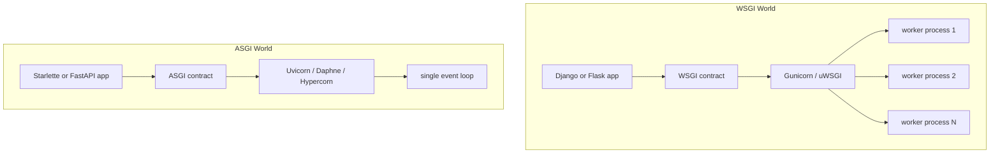

# Python web servers

The question this doc answers: when you pick Django versus FastAPI, what is
actually different underneath, and what does each name (WSGI, ASGI,
Gunicorn, Uvicorn, Starlette) actually refer to? This is the
Python-web-specific layer that sits on top of two more general ideas
covered elsewhere: the OS-level concurrency models in
[docs/concepts/concurrency-models.md](concurrency-models.md) (threads, processes, event loops),
and the general concept of why web servers and web frameworks talk
through a shared contract at all, covered language-agnostically in
[docs/concepts/web-frameworks-and-servers.md](web-frameworks-and-servers.md). Reading that second doc
first is the fastest way to understand what WSGI and ASGI fundamentally
*are*, before this doc gets into their Python-specific names and tools.

## The problem WSGI was created to solve

Before WSGI existed, in the late 1990s and early 2000s, every Python web
framework had to talk to every web server through its own custom,
incompatible glue code. If you wrote a framework and wanted it to run under
Apache, you wrote Apache-specific glue. If you wanted it to also run under
some other server, you wrote another, completely separate piece of glue.
Every framework-server pair needed its own adapter, which meant framework
authors and server authors were both locked into whichever pairings someone
had bothered to write.

**WSGI** (Web Server Gateway Interface) was created to fix exactly that. It
is defined in [PEP 3333](https://peps.python.org/pep-3333/), and its own
text states the goal plainly: "to promote web application portability
across a variety of web servers." WSGI isn't a piece of software you
install. It's a specification, a plain contract that says: if a web server
speaks WSGI, and a framework speaks WSGI, they can be plugged together, no
matter who wrote either side. Any WSGI framework works with any WSGI
server. That's the entire point, and it's why Django, Flask, and dozens of
smaller frameworks all speak it.

Structurally, the contract is about as simple as a contract can be. A WSGI
application is a single, **synchronous** Python callable. The server calls
it once per request, passing in the environment (headers, method, path,
body), and the callable is expected to compute and return a full response.
The server calls, blocks until it gets a response back, sends that response
to the client, and moves to the next request. There's no concept of a
request that stays open, or of the framework doing anything else while it
waits, that shape doesn't exist in the contract at all.

## The cost of synchronous WSGI at scale

That callable shape is worth being explicit about, because it doesn't
mean a WSGI app can't handle many users. WSGI itself has no built-in
concept of concurrency, it's purely the contract for handling one request.
Whatever handles many requests "at once" is a completely separate layer,
sitting outside WSGI, described in the next section. What the WSGI contract
does rule out, permanently, no matter how that outer layer is built, is a
single call being anything other than blocking, request in, response out,
nothing in between. That's fine for the huge majority of ordinary web
traffic: a page load, a form submit, a JSON API call, all naturally fit
"request in, response out." It becomes a real limitation only for anything
that needs a connection to stay open and exchange multiple messages over
time, a live chat over WebSocket, a long-poll waiting on a slow event, a
server pushing updates as they happen. WSGI has no way to express that at
all, the callable has already returned before any of that could happen.

## How a WSGI app actually serves many users

A Django or Flask app answering thousands of requests a second isn't doing
anything clever inside WSGI. The concurrency comes from a server process
running in front of the app, most commonly **Gunicorn** on Linux (or
**uWSGI**, or `mod_wsgi` under Apache). That server starts several
**worker processes**, and often several threads inside each one, each
running a full, independent copy of the app. An incoming request goes to
whichever worker happens to be free, and that worker runs the synchronous
application code **blocking**, start to finish, exactly as the WSGI
contract describes.

This is literally the process-per-connection and thread-per-connection
models from [docs/concepts/concurrency-models.md](concurrency-models.md), applied to Python web
apps specifically, not the event-loop model. "Handling many requests at
once" here means many separate workers are each blocked on their own single
request in parallel, not that any one worker is juggling several requests
the way an event loop does. It works, and it's how the large majority of
production Django and Flask deployments actually run today. It scales by
adding more worker processes (bounded by CPU cores and memory, per the
process-per-connection cost described in the concurrency doc), not by any
one worker becoming more efficient at overlapping work.

## WSGI's suitability for production

WSGI plus Gunicorn (or uWSGI) is a completely standard, battle-tested
production setup. It has run a huge share of the web for two decades and
still does. The caveat isn't about request volume or request rate, a
worker-pool WSGI server genuinely can handle thousands of requests per
second, the same way thread-per-request Java servers did for years (see
[docs/concepts/concurrency-models.md](concurrency-models.md)). The caveat is specifically about
**long-lived, multi-message connections**: WebSockets, Server-Sent Events,
long-polling. Those don't fit the "one request in, one response out, then
the callable returns" shape at all, no amount of worker tuning changes
that, because the limitation is in the contract itself, not in how fast any
one implementation runs it.

## The ASGI async successor

**ASGI** (Asynchronous Server Gateway Interface) was created as what its
own docs call "a spiritual successor to WSGI... into the land of
asynchronous Python"
([asgi.readthedocs.io/en/latest/introduction.html](https://asgi.readthedocs.io/en/latest/introduction.html)).
It names the exact gap from the section above as the problem it exists to
close: "WSGI applications are a single, synchronous callable that takes a
request and returns a response; this doesn't allow for long-lived
connections, like you get with long-poll HTTP or WebSocket connections,"
and "protocols that have multiple incoming events (like receiving WebSocket
frames) can't trigger this" single request/response pathway at all.

ASGI replaces the single blocking callable with "a single, *asynchronous*
callable" that takes a `scope` (connection details) plus `send`/`receive`
async functions, so a connection can have many events flow in both
directions over its whole lifetime, not just one. An HTTP request/response,
a WebSocket exchange, and an SSE stream all end up being different shapes
of that one same underlying model. Structurally, ASGI is doing the same job
WSGI did (a stable contract any framework and any server can both agree
to), it's just a contract shaped for connections that stay open, and
naturally implemented with the event-loop model from
[docs/concepts/concurrency-models.md](concurrency-models.md) instead of the worker-pool model.

## The server layer and who runs what

WSGI and ASGI are specifications, not programs. Something has to actually
open a socket, accept connections, and speak the contract. That's the job
of a **WSGI server** or an **ASGI server**, and this is where the tool
names live:

- **Gunicorn** ("Green Unicorn") is the standard WSGI server. It's a
  process manager: it starts a configurable number of worker processes,
  each running a full copy of the WSGI app, and routes each incoming
  request to a free worker. This is the Gunicorn+Django or Gunicorn+Flask
  pairing described above.
- **uWSGI** is an older, more configurable alternative to Gunicorn, doing
  the same fundamental job for WSGI apps, with a much larger and more
  complex configuration surface.
- **Uvicorn** is the equivalent piece for ASGI. It's an ASGI server built
  on top of `uvloop` and `asyncio`, running the app's event loop directly,
  rather than spawning a worker per request. This is what actually runs a
  FastAPI or Starlette app: `main.py` doesn't listen on a socket by itself,
  Uvicorn does, and it drives the ASGI app's async callable inside its own
  event loop.
- **Daphne** and **Hypercorn** are the other commonly used ASGI servers.
  Daphne was the original reference server built alongside the ASGI spec
  itself (from the Django Channels project); Hypercorn additionally
  supports the HTTP/2 protocol. Functionally, all three (Uvicorn, Daphne,
  Hypercorn) implement the same ASGI contract, so an ASGI app can generally
  run under any of them.

**Is Uvicorn ever used with WSGI apps?** No, not directly, an ASGI server
doesn't speak the WSGI contract, and a WSGI app has no `scope`/`send`/
`receive` async interface for it to call. What does exist is an *adapter*
layer, such as Starlette's `WSGIMiddleware` or the standalone `a2wsgi`
package, which wraps an old WSGI app inside an ASGI-shaped callable so it
can be mounted inside a larger ASGI application (for example, serving a
legacy Flask app as one route inside a FastAPI app). That's a compatibility
bridge for migration, not Uvicorn natively running WSGI.

**One production wrinkle worth naming**: Uvicorn on its own runs as a
single process, one event loop, same as any event-loop server described in
[docs/concepts/concurrency-models.md](concurrency-models.md). To use more than one CPU core, the
common real-world pattern is running Uvicorn's own worker manager, or
running it *under* Gunicorn using Gunicorn's `UvicornWorker` worker class.
That combination, Gunicorn managing several Uvicorn-driven worker
processes, gets you both: process-level parallelism across CPU cores from
Gunicorn, and event-loop-level concurrency for I/O-bound waiting inside
each individual worker.

## Where Starlette fits

**Starlette** is the toolkit FastAPI is built directly on top of. It isn't
a server (that's Uvicorn's job) and it isn't a bare specification (that's
ASGI's job). It sits in between: an actual framework that implements the
ASGI contract and adds the pieces every real app needs on top of it,
routing, WebSocket support, background tasks, startup/shutdown events, and
streaming responses. Starlette describes itself
([starlette.io](https://www.starlette.io/)) as "a lightweight ASGI
framework/toolkit, which is ideal for building async web services in
Python." FastAPI adds a further layer on top of Starlette: the
Pydantic-based request/response validation and the type-hint-driven API
that FastAPI is actually known for (see [docs/concepts/pydantic.md](pydantic.md)). Every
`StreamingResponse`, WebSocket handler, or background task inside a FastAPI
app is Starlette functionality underneath, FastAPI itself doesn't
reimplement any of that.

Django doesn't have a direct equivalent to "Starlette." Its ASGI support
(described below) is built into the Django project itself, rather than
delegated to a separate underlying toolkit the way FastAPI delegates to
Starlette.

## Where Django and Flask actually stand today

**Flask** is still, by default, a pure WSGI framework. Its own request
handling model is synchronous, request in, response out, run by Gunicorn
or uWSGI workers as described above. Flask does support `async def` view
functions since Flask 2.0, but that support is a compatibility shim, not a
change to Flask's core model: each async view still runs inside a worker,
wrapped so it can be awaited, rather than Flask itself running an event
loop the way an ASGI server does. Flask has no first-class WebSocket
support without a separate extension (`Flask-Sockets` or similar), because
the underlying WSGI contract it's built on has no concept of a connection
that stays open.

**Django** has moved further. It now supports `async def` views and a real
ASGI-based request stack (`django.core.asgi`) alongside its original WSGI
entry point (`django.core.wsgi`), and many ORM methods have async variants,
prefixed with `a`, such as `afirst()`. But per Django's own async docs
([docs.djangoproject.com/en/stable/topics/async](https://docs.djangoproject.com/en/stable/topics/async/)),
this wasn't a free retrofit: "Certain key parts of Django are not able to
operate safely in an async environment, as they have global state that is
not coroutine-aware," and concretely, "transactions do not yet work in
async mode," requiring those code paths to be wrapped with
`sync_to_async()` to call safely from an async view. This is the concrete,
real-world version of the "viral" cost described in
[docs/concepts/concurrency-models.md](concurrency-models.md): bolting async support onto a
codebase built around a synchronous mental model for over a decade is a
genuine, gradual engineering effort, not a flag you flip. Django today can
genuinely be deployed either way, under Gunicorn as a WSGI app, or under
Uvicorn/Daphne as an ASGI app, but its ORM and much of its ecosystem still
carry synchronous assumptions in places async-native frameworks don't.

## Putting the whole stack together

For a FastAPI request in this project specifically, the layers from bottom
to top are:

1. **Uvicorn**, the ASGI server, accepts the TCP connection and speaks the
   ASGI protocol.
2. **Starlette**, underneath FastAPI, implements routing, request/response
   objects, and the actual ASGI callable.
3. **FastAPI** adds request/response validation and serialization on top,
   driven by type hints and Pydantic models.
4. Your route function (`async def` or plain `def`, see
   [docs/concepts/fastapi.md](fastapi.md) for how FastAPI decides which one runs where)
   is the actual application code, the only layer you write by hand.

For a Django app running the traditional way, the equivalent stack is
Gunicorn (or uWSGI) in place of Uvicorn, WSGI in place of ASGI, and
Django's own request/response and ORM layers in place of Starlette and
FastAPI. Same overall shape (server, contract, framework, your code), built
on the older, synchronous half of the two contracts described in this doc.

See [docs/concepts/concurrency-models.md](concurrency-models.md) for the OS-level models
(processes, threads, event loops) all of this is ultimately built on, and
[docs/concepts/fastapi.md](fastapi.md) for how FastAPI decides, per-route, whether your
code runs on the event loop directly or gets handed off to a thread pool.
