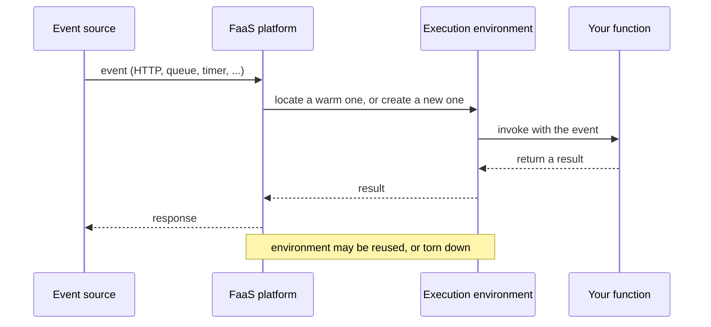
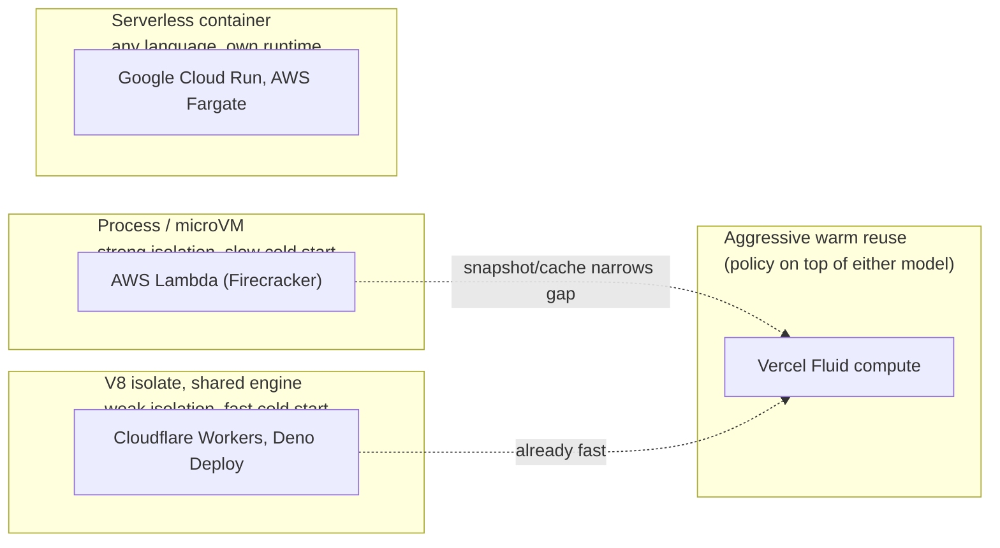

# Serverless architecture

Every other server doc in this project assumes a process that starts up,
binds a port, and keeps running. **Serverless** is the other shape: code
with no long-running process behind it, started fresh (or reused) per
unit of work, billed per invocation. This doc covers what the word
means, why cold starts happen, and how platforms differ, independent of
any one language. [docs/concepts/javascript-serverless.md](javascript-serverless.md)
maps this onto specific JS platforms.

## Table of contents

- [The big picture](#the-big-picture)
- [BaaS vs FaaS](#baas-vs-faas)
- [The invocation lifecycle](#the-invocation-lifecycle)
- [The cold start trade-off](#the-cold-start-trade-off)
- [Three isolation models, plus containers](#three-isolation-models-plus-containers)
- [Cold starts by language](#cold-starts-by-language)
- [Platform landscape](#platform-landscape)
- [Constraints of the model](#constraints-of-the-model)
- [When serverless fits](#when-serverless-fits)
- [See also](#see-also)

## The big picture

```mermaid
flowchart TD
    S["'Serverless'"] --> BaaS["Backend as a Service (BaaS)<br/>vendor owns the whole backend piece"]
    S --> FaaS["Functions as a Service (FaaS)<br/>you write the code, vendor runs it"]
    FaaS --> Iso["Isolation model<br/>(how each invocation is sandboxed)"]
    Iso --> Heavy["Process / microVM<br/>strong isolation, slower cold start"]
    Iso --> Light["V8 isolate<br/>weaker isolation, fast cold start"]
    Iso --> Cont["Serverless container<br/>any language, own runtime"]
    FaaS -.covered per-platform in.-> JS["docs/concepts/javascript-serverless.md"]
```

This doc is mostly about the FaaS branch: that's where the actual
runtime mechanics (isolation, cold starts, scaling) live.

## BaaS vs FaaS

Martin Fowler's definition, per
[martinfowler.com/articles/serverless.html](https://martinfowler.com/articles/serverless.html):

| | Definition (Fowler's words) | Examples |
|---|---|---|
| **BaaS** | App "incorporate[s] third-party, cloud-hosted... services to manage server-side logic and state" | Supabase's hosted Postgres/auth/storage |
| **FaaS** | "Server-side logic... run in stateless compute containers that are event-triggered, ephemeral... and fully managed by a third party" | AWS Lambda, Cloudflare Workers, Azure Functions |

Supabase mixes both: the database/auth/storage is BaaS, Edge Functions
running on top is FaaS.

## The invocation lifecycle

Every FaaS platform follows the same shape:

Nothing about process, memory, or open connections is guaranteed to
survive between invocations. The platform, not your code, decides
whether an environment gets reused (**warm**) or built from scratch
(**cold**).

## The cold start trade-off

A **cold start** is the extra latency of building a fresh execution
environment before your code can even run. AWS's own docs: "the largest
contributor to startup latency... is the time that Lambda spends
initializing the function," per
[docs.aws.amazon.com/lambda/latest/dg/snapstart.html](https://docs.aws.amazon.com/lambda/latest/dg/snapstart.html).

**The core trade-off every platform is negotiating**: stronger isolation
between invocations costs more cold-start latency; faster cold starts
come from weaker isolation.

## Three isolation models, plus containers

| Model | Mechanism | Isolation | Cold start | Example |
|---|---|---|---|---|
| Process/microVM | New OS process or Firecracker microVM per invocation | Strong (VM boundary) | Slowest | AWS Lambda |
| V8 isolate | One running engine hosts many sandboxed JS contexts | Weaker (engine-level) | ~100x faster than a process, per [Cloudflare's own docs](https://developers.cloudflare.com/workers/reference/how-workers-works/) | Cloudflare Workers, Deno Deploy |
| Aggressive reuse | Not a new mechanism, a scheduling policy: keep instances warm, reuse across requests | Same as underlying model | Rare rather than fast | Vercel Fluid compute |
| Serverless container | Ordinary container image, platform scales it to zero | Container-level | Standard container cold start | Google Cloud Run, AWS Fargate |

Serverless containers trade FaaS's single-function simplicity for
"bring your own language and runtime," while keeping scale-to-zero
economics.

## Cold starts by language

An independent benchmark of four million real Lambda invocations found
cold-start medians of **Rust 16ms, Go 53ms, Python 76ms, Java 368ms**,
per [Illya Yalovoy's writeup](https://medium.com/@yalovoy/four-million-lambda-invokes-across-python-java-rust-and-go-5b9218f64563).
Compiled languages with no VM to boot are fastest; a language on a heavy
managed runtime (the JVM) is slowest.

AWS built **SnapStart** specifically for that JVM-heavy end: it
snapshots an already-initialized environment and resumes from it on
future cold starts, per the [SnapStart docs](https://docs.aws.amazon.com/lambda/latest/dg/snapstart.html)
above. It only covers **Java 11+, Python 3.12+, and .NET 8+**,
explicitly excluding Node.js and Ruby.

This whole section is specific to the process/microVM model. The
V8-isolate model mostly sidesteps it, since no fresh language VM boots
per invocation at all.

## Platform landscape

| Platform | Isolation model | Languages | Notable constraint |
|---|---|---|---|
| AWS Lambda | Process/microVM | Node.js, Python, Java, Ruby, .NET managed; Go/Rust via custom runtime | SnapStart excludes Node.js and custom runtimes |
| Google Cloud Functions | Process/container | JavaScript, Python, Go | Narrower language list than Lambda/Cloud Run |
| Google Cloud Run | Serverless container | Any containerizable language | Needs a real container image, not a handler file |
| Azure Functions | Process/container | C#, JS/TS, Python, PowerShell, Java | No containerization required |
| Cloudflare Workers | V8 isolate | JS/TS natively, others via WASM | No filesystem, no background process |
| Deno Deploy | V8 isolate | JS/TS | Same isolate trade-offs as Workers |
| Vercel Functions | Both: process/microVM (Node.js runtime) *or* V8 isolate (Edge runtime) | Node.js, Python, Go, Rust, Ruby, + more | Two isolation models under one product name |
| Supabase Edge Functions | V8 isolate (Deno-based) | TypeScript/JavaScript | Explicitly "short-lived, idempotent operations" only |

Not a ranking; each vendor traded isolation strength against cold-start
speed differently on purpose.

## Constraints of the model

- **Max execution duration** — every platform caps invocation length; long jobs need a queue + worker instead.
- **No durable local state** — nothing written locally survives between invocations; state must live externally (DB, object store).
- **More network round trips** — no warm connection pool or in-memory cache sitting there between requests.
- **Cold starts** — a real, sometimes user-visible tax; mitigations are platform-specific, not universal.
- **Concurrency limits** — shared infrastructure means a hard per-account/function ceiling can throttle spikes.

## When serverless fits

| Serverless fits | Always-on server fits better |
|---|---|
| Spiky, unpredictable, or low-average traffic | Steady, high-volume, latency-sensitive traffic |
| Naturally event-shaped work (webhook, upload, cron) | Work that benefits from long-lived state (connection pools, caches, WebSockets) |
| Paying per-invocation beats paying for idle time | Cold starts would be an ongoing, not rare, tax |

Neither model is strictly better; [docs/concepts/concurrency-models.md](concurrency-models.md)
covers why an always-on event loop can already serve huge numbers of
idle connections cheaply, an argument that only holds if the process
stays running, which is exactly what serverless gives up.

## See also

- [docs/concepts/javascript-serverless.md](javascript-serverless.md) — this vocabulary applied to real JS platforms.
- [docs/concepts/javascript-runtimes.md](javascript-runtimes.md) — engine/host-API/runtime split underlying JS FaaS platforms.
- [docs/concepts/concurrency-models.md](concurrency-models.md) — the always-on alternative this doc contrasts against.
- [docs/concepts/web-frameworks-and-servers.md](web-frameworks-and-servers.md), [docs/concepts/javascript-web-servers.md](javascript-web-servers.md), [docs/concepts/python-web-servers.md](python-web-servers.md) — all assume the always-on model this doc contrasts with.
