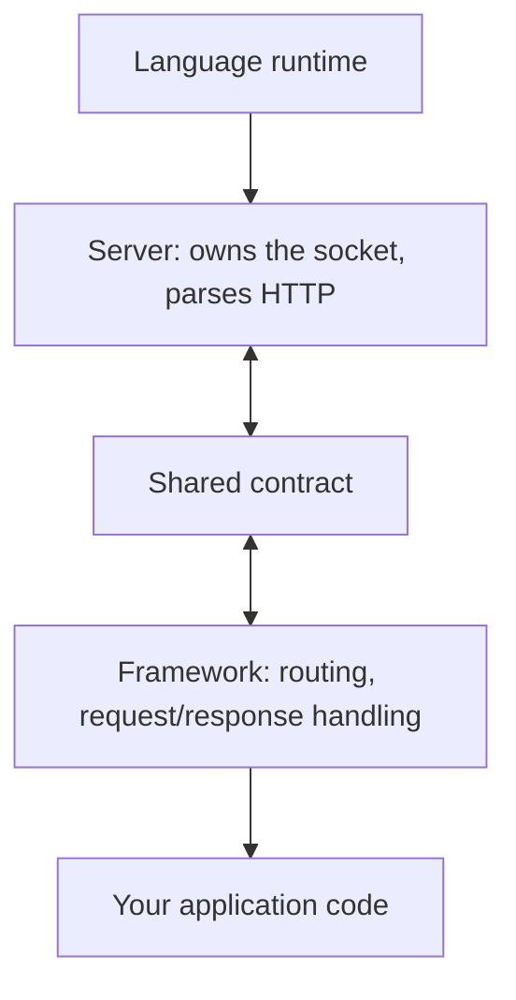
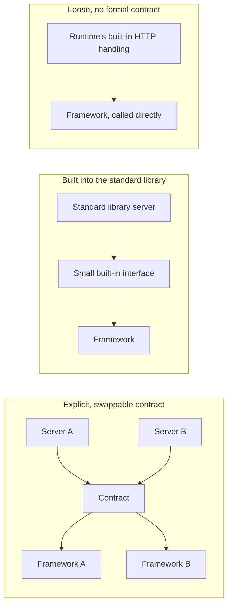

# Web frameworks and servers

The question this doc answers: why are a web server and a web framework
built as two separate pieces of software at all, and what does it actually
mean for them to "talk" to each other? This is a general concept that
shows up across almost every programming language, not something specific
to Python. See
[docs/concepts/python-web-servers.md](python-web-servers.md) for how Python specifically names
and implements the ideas covered here (WSGI, ASGI, Gunicorn, Uvicorn), and
[docs/concepts/concurrency-models.md](concurrency-models.md) for the OS-level concurrency ideas
(threads, processes, event loops) that the server side of this picture is
built on.

## Table of contents

- [Server responsibilities vs. framework responsibilities](#server-responsibilities-vs-framework-responsibilities)
- [Why a shared contract is necessary](#why-a-shared-contract-is-necessary)
- [How the shared contract works](#how-the-shared-contract-works)
- [Benefits of a shared contract](#benefits-of-a-shared-contract)
- [The general architecture](#the-general-architecture)
- [Three approaches to the server-framework boundary](#three-approaches-to-the-server-framework-boundary)
- [Contract names by ecosystem](#contract-names-by-ecosystem)
- [Sync vs. async by language](#sync-vs-async-by-language)
- [Terminology appendix](#terminology-appendix)

## Server responsibilities vs. framework responsibilities

Start with what each side is actually responsible for, because the split
only makes sense once the two jobs are separated out.

**The server's job** is to own the actual network connection. Something
has to accept an incoming TCP connection, read the raw bytes arriving over
the wire, and make sense of them as an HTTP request: a method, a path,
headers, a body. It also has to manage many connections at once, keep
slow or idle ones alive without wasting resources, handle malformed
input, and eventually turn a response back into bytes and write them back
out. None of that has anything to do with what your specific application
is supposed to do. It's protocol-level plumbing, the same kind of work
regardless of whether the app behind it is a blog, a shopping cart, or a
weather API.

**The framework's job** is to decide what happens once a request has
already been turned into something structured. Given "someone requested
`GET /users/42`," look up the matching piece of application code, run it,
maybe read from a database, and produce a response. That's business
logic: routing, validation, templates, data access. It has no interest in
how the bytes got parsed off the wire in the first place, and it
shouldn't need to.

These are genuinely different skills, usually built by different teams or
different open-source projects entirely. A team that's excellent at
squeezing performance out of raw socket handling and connection
management isn't necessarily the same team that's good at designing a
clean routing API or an ORM. So in practice, almost every language
ecosystem ends up with these as two separate pieces of software, and
somebody has to define how they connect.

## Why a shared contract is necessary

If a server and a framework are separate programs, the server has to hand
each parsed request over to the framework somehow, and get a response
back. The most naive way to do that is for the server's authors and the
framework's authors to agree, one on one, on exactly how that handoff
works: what shape the request comes in, how the framework returns a
response, and so on.

That works, as long as there's exactly one server and one framework. It
falls apart the moment there's more than one of either. If there are five
popular servers and ten popular frameworks in a language, and every
server/framework pair needs its own custom glue code, that's up to fifty
separate integrations, each one written and maintained by hand, each one
breaking separately when either side changes. Worse, a framework author
who wants their framework to work with a new server has to go write new
glue for it, and a server author who wants to support a new framework has
the same problem in reverse. Nobody can be swapped out independently.

## How the shared contract works

The fix every mature ecosystem eventually arrives at is the same: define
one shared, published contract that sits between the server and the
framework, so any compliant server can run any compliant framework with
zero custom glue. This turns an N-times-M integration problem (every
server times every framework) into an N-plus-M problem (each side only
has to agree with the contract, once).

Python's own spec for this states its goal directly, and it generalizes
to every ecosystem below: WSGI exists "to promote web application
portability across a variety of web servers"
([PEP 3333](https://peps.python.org/pep-3333/)). Ruby's Rack states the
same goal about itself: it "unifies and distills the bridge between web
servers, web frameworks, and web application into a single method call"
([github.com/rack/rack](https://github.com/rack/rack)). Java's Servlet
API frames it the same way, components that "use a standard API that is
supported by many web servers"
([Jakarta Servlet Specification](https://jakarta.ee/specifications/servlet/6.0/jakarta-servlet-spec-6.0)).
Same fix, three ecosystems, same words: standard, portable, supported by
many.

## Benefits of a shared contract

- **Swappability.** Change which server runs your app without rewriting
  it, since the app is written against the shared contract, not a
  specific server. This is the exact benefit PEP 3333 names above:
  "portability across a variety of web servers."
- **Specialization.** Server authors focus on connection handling,
  framework authors focus on application ergonomics, neither needs to
  understand the other's internals.
- **An ecosystem, instead of a single vendor's stack.** Multiple
  independent servers and frameworks coexist and mix freely, which is why
  "which server" and "which framework" are usually two separate
  decisions, not one bundled choice.

## The general architecture

The pieces involved, from the bottom up, regardless of language:

- **The language runtime**: the actual engine executing your code (the
  Python interpreter, the Java Virtual Machine, Node's V8 engine, Go's
  compiled binary). This is what's actually running everything below and
  above it.
- **The server**: owns the socket, speaks raw HTTP (or WebSocket, or
  whatever protocol is in play), and turns bytes into structured requests
  and back.
- **The contract**: the shared agreement in the middle, described above.
- **The framework**: routing, request/response handling, and the
  conveniences application developers actually write code against.
- **Your application code**: the actual business logic you write, sitting
  on top of all of it.

The double-headed arrows through the contract are the important part:
the server calls into the framework through it, and the framework hands a
response back through it, the same shared shape both directions.

## Three approaches to the server-framework boundary

The concept above is universal, but how visible and formal the line
between "server" and "framework" is varies quite a bit by ecosystem.
Roughly three shapes show up repeatedly:

**Explicit, swappable contract, multiple competing servers.** This is the
shape described above in its fullest form: a published, independent
specification, with several unrelated servers and several unrelated
frameworks all built against it, freely mixable. Python's WSGI/ASGI, Ruby's
Rack, and Java's Servlet API all work this way, per the three quotes
above. In each of these ecosystems, "which server" and "which framework"
really are separate choices you make independently.

**Built into the standard library, contract still exists but rarely
swapped.** Some languages ship a solid, official HTTP server as part of
the language's own standard library, along with a small built-in
interface that frameworks build against. The contract still exists, but
because the standard library's own server is already good enough and
already the default, there's rarely a reason to reach for a competing
implementation. Go works this way: the standard library documents a
single, minimal interface, `type Handler interface { ServeHTTP(...) }`,
and `ListenAndServe` "listens on the TCP network address addr and then
calls Serve with handler to handle requests on incoming connections"
([pkg.go.dev/net/http](https://pkg.go.dev/net/http)). Both the server and
the contract ship in the same standard library, so the split is real but
far less visible day to day.

**Loose, no formal published contract.** Some ecosystems never developed
a widely adopted, independent specification at all. The "server" is a
built-in piece of the runtime itself, and frameworks are just ordinary
libraries that call directly into it, without a separately documented,
swappable contract standing between them. JavaScript on Node.js leans
this way: Node's own docs describe its `http` module as deliberately
low-level, "it deals with stream handling and message parsing only,"
without a separate, independently specified contract on top
([nodejs.org/api/http.html](https://nodejs.org/api/http.html)).
Frameworks like Express build directly on that low-level module as
regular library code, not through a published interface the way WSGI or
the Servlet API define one. See [docs/concepts/javascript-web-servers.md](javascript-web-servers.md)
for whether this looseness is actually an ecosystem problem, and how
Bun, Deno, Hono, and Elysia handle it in practice.

None of these three shapes is "better" in some absolute sense. They're
different tradeoffs between flexibility (many swappable pieces) and
simplicity (fewer moving parts to understand). Where an ecosystem lands
mostly comes down to its history: whether multiple competing servers
existed early enough that developers actually felt the "everything needs
custom glue" pain described earlier, which is what tends to motivate a
formal contract getting written and adopted in the first place.

## Contract names by ecosystem

Just for orientation, since the names get thrown around a lot without
context. This is naming only, not implementation detail:

| Ecosystem | The contract's name | Source |
|---|---|---|
| Python | WSGI (synchronous), ASGI (asynchronous) | [PEP 3333](https://peps.python.org/pep-3333/), [asgi.readthedocs.io](https://asgi.readthedocs.io/en/latest/introduction.html) |
| Ruby | Rack | [github.com/rack/rack](https://github.com/rack/rack) |
| Java | Servlet API (Jakarta Servlet) | [Jakarta Servlet Spec](https://jakarta.ee/specifications/servlet/6.0/jakarta-servlet-spec-6.0) |
| Go | The standard library's own `Handler` interface | [pkg.go.dev/net/http](https://pkg.go.dev/net/http) |
| Rust | No single official spec; `tower::Service` is the de facto shared abstraction | [docs.rs/tower](https://docs.rs/tower/latest/tower/trait.Service.html), [docs.rs/axum](https://docs.rs/axum/latest/axum/) |
| Node.js / JavaScript | No single widely adopted equivalent | [nodejs.org/api/http.html](https://nodejs.org/api/http.html) |

See [docs/concepts/python-web-servers.md](python-web-servers.md) for what these actually look
like in practice on the Python side, including the specific tools
(Gunicorn, Uvicorn, Starlette) that implement the server and framework
roles described in this doc.

## Sync vs. async by language

A quick orientation, not a deep dive, on whether each language's default
web servers are synchronous (blocking, thread or process based) or
asynchronous (non-blocking, event loop or coroutine based).

- **Ruby**: synchronous by default. **Puma**, the most widely used Ruby
  server, describes itself as "multi-threaded... each request is served
  in a separate thread," plus "multi-process" pre-forking for more
  parallelism, per [github.com/puma/puma](https://github.com/puma/puma).
  That's blocking code, run concurrently through threads and worker
  processes, not an event loop. An async alternative exists (the
  `Falcon` server, built on Ruby's `Async` gem and fibers), but it isn't
  the ecosystem's default the way Puma is.
- **Java**: historically synchronous (thread-per-request under a servlet
  container like Tomcat), but the Servlet API has supported explicit
  asynchronous processing since Servlet 3.0, letting a request "wait for
  a resource or event" without holding a thread, via `startAsync()` and
  `AsyncContext`, per the
  [Jakarta Servlet Specification](https://jakarta.ee/specifications/servlet/6.0/jakarta-servlet-spec-6.0).
  Fully async, event-loop-based frameworks (Netty, Vert.x, Spring
  WebFlux) also exist alongside the traditional blocking default. Java 21
  also added virtual threads, which let ordinary blocking-style code
  scale like async code without being rewritten (see
  [docs/concepts/concurrency-models.md](concurrency-models.md) for more on that model).
- **Go**: written as synchronous-looking, blocking code, but each request
  runs in its own **goroutine**, a lightweight function the Go runtime
  multiplexes onto a small number of OS threads. Go's own FAQ explains
  the mechanism: "when a coroutine blocks... the run-time automatically
  moves other coroutines on the same operating system thread to a
  different, runnable thread so they won't be blocked," per
  [go.dev/doc/faq](https://go.dev/doc/faq#goroutines). So the code you
  write looks synchronous, but the runtime handles it more like an
  async system underneath, without you writing `async`/`await` anywhere.
- **Rust**: async by default, and explicitly so. Rust has no built-in
  runtime for this the way Go does, you bring one in as a dependency,
  and the standard choice is **Tokio**, described on its own site as "an
  asynchronous runtime for the Rust programming language" that "provides
  the building blocks needed for writing network applications," per
  [tokio.rs](https://tokio.rs/). Popular Rust web frameworks (Actix Web,
  Axum) are built on Tokio and use `async`/`await` throughout, closer in
  spirit to Python's ASGI or Node's event loop than to Go's
  hidden-under-the-hood approach.

---

## Terminology appendix

- **Socket**: the OS-level handle representing one end of a network
  connection. Something has to hold this open and read/write bytes
  through it; that's the server's job.
- **Contract / interface / specification**: three names for the same
  underlying idea used throughout this doc, an agreed-upon shape that
  multiple independent pieces of software can be built against, so they
  can be combined without custom integration work. Which word gets used
  is mostly a matter of each ecosystem's own convention, not a meaningful
  technical difference.
- **Runtime**: the software actually executing your program's code (an
  interpreter, a virtual machine, or a compiled binary running directly).
  Distinct from both the server and the framework; it's what's running
  underneath both of them.
- **Middleware**: a small, optional piece of code that sits in the
  request/response flow between the server and your actual application
  code (for logging, authentication checks, compression, and similar
  cross-cutting concerns). Mentioned here because it's a term that shows
  up constantly once you start reading about either WSGI/ASGI or other
  ecosystems' equivalents, but it isn't a core part of the server/
  framework split itself, more of a plugin point within it.
